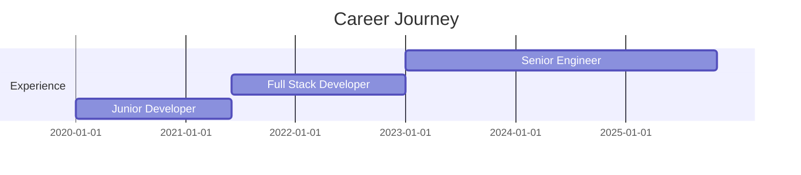

# 🚀 RUDRA PEASH DAS

### `< Full-Stack Engineer />` | `System Architect` | `Open Source Contributor`

---

## 💫 About Me

<table>
<tr>
<td width="50%" valign="top">

### 🚀 Quick Facts

- 🌏 **Based in:** Khulna, Bangladesh
- 💼 **Role:** Full-Stack Engineer & System Architect
- 🎯 **Focus:** Kubernetes • Rust • System Design
- 🏗️ **Architecture:** Microservices, Event-Driven, Serverless
- 🎤 **Speaker** at Tech Meetups & Conferences
- ✍️ **Writer** of Technical Blogs & Tutorials
- 🌟 **Mentor** in Open Source Programs

</td>
<td width="50%" valign="top">

### 🎯 Currently Working On

- 🔭 Building **Next-Gen SaaS Platform** with modern architecture
- 🌱 Deep diving into **Kubernetes orchestration** & **Rust performance**
- 👯 Open to collaborate on **developer tools** & **cloud-native apps**
- 💡 Exploring **AI/ML integration** in web applications
- ⚡ Writing about **system design** & **best practices**
- 🎪 **Challenge:** Building systems that scale to millions

</td>
</tr>
</table>

### 💭 Fun Fact: *"I debug in production (just kidding... or am I? 😅)"*

---

## 🛠️ Tech Arsenal

### 💻 Languages

### 🎨 Frontend

### ⚙️ Backend

### 🗄️ Databases

### ☁️ DevOps & Cloud

---

## 🏆 Featured Projects

<table>
<tr>
<td width="50%">

### 🚀 Project Alpha

**Real-time collaboration platform** with WebSocket infrastructure

`React` `Node.js` `PostgreSQL` `Redis` `Docker`

⭐ 500+ Stars | 🍴 120+ Forks

</td>
<td width="50%">

### 🎯 Project Beta

**Serverless API gateway** with auto-scaling capabilities

`Next.js` `AWS Lambda` `DynamoDB` `Terraform`

⭐ 350+ Stars | 🍴 80+ Forks

</td>
</tr>
<tr>
<td width="50%">

### 💡 Project Gamma

**AI-powered code analyzer** for performance optimization

`Go` `Python` `TensorFlow` `Kubernetes`

⭐ 280+ Stars | 🍴 60+ Forks

</td>
<td width="50%">

### 🔥 Project Delta

**Distributed task scheduler** with message queue

`Rust` `RabbitMQ` `gRPC` `Docker`

⭐ 190+ Stars | 🍴 45+ Forks

</td>
</tr>
</table>

---

## 📊 GitHub Analytics

  

  

---

## 🏆 Achievements & Trophies

---

## 📝 Latest Blog Posts

<!-- BLOG-POST-LIST:START -->
- 🚀 [Building Scalable Microservices with Kubernetes](https://yourblog.com/post1)
- ⚡ [Advanced TypeScript Patterns for Enterprise Applications](https://yourblog.com/post2)
- 🎯 [Zero-Downtime Deployments: A Practical Guide](https://yourblog.com/post3)
- 💡 [System Design Interview: Tips from a Senior Engineer](https://yourblog.com/post4)
<!-- BLOG-POST-LIST:END -->

---

## 💼 Professional Experience Timeline

---

## 📈 Contribution Stats

---

## 🎯 2025 Goals

- [ ] Contribute to 10 major open source projects
- [ ] Publish 50 technical articles
- [ ] Master Rust & WebAssembly
- [ ] Build a product with 10k+ active users
- [ ] Speak at 3 international tech conferences

---

## 💬 Random Dev Quote

---

## 🐍 Contribution Snake

---

## 📫 Let's Connect

### 💌 Email: peash@youremail.com

---

### 🔥 Profile Views Counter

### ⚡ "Code is like humor. When you have to explain it, it's bad." – Cory House

**Made with 💙 and lots of ☕**

⭐ **If you like my work, consider giving my repos a star!** ⭐

