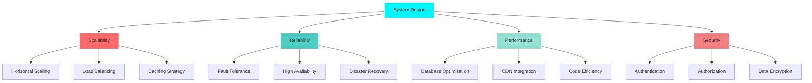
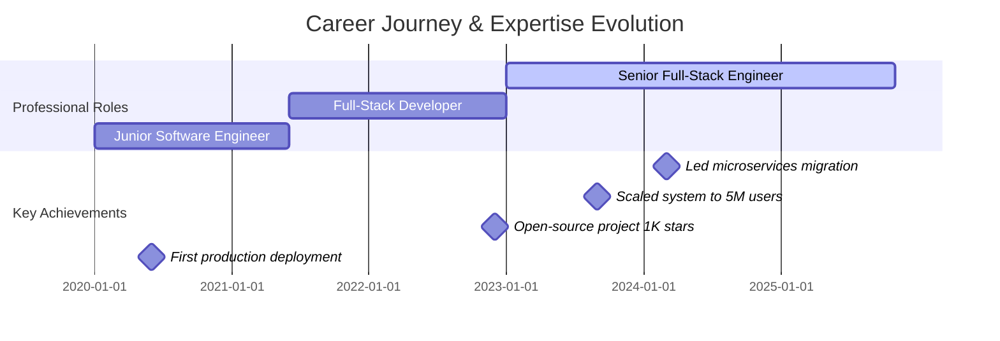
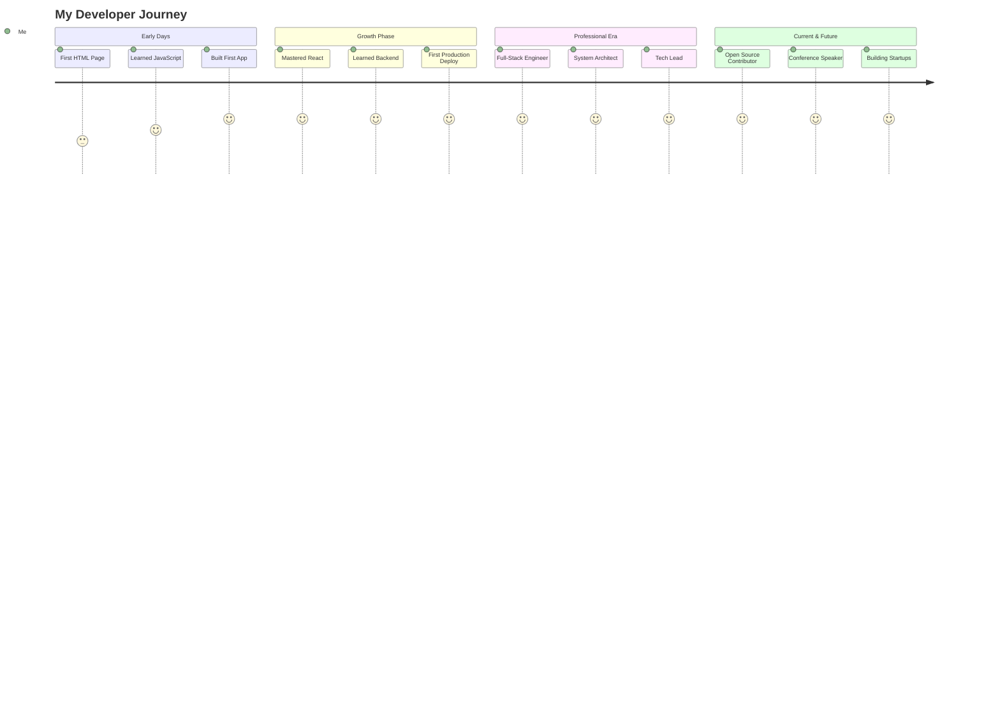

<div align="center">


# 💻 Full-Stack Architect | 🚀 System Designer | ⚡ Performance Engineer

[](https://git.io/typing-svg)

<br>

<p align="center">
  <a href="https://twitter.com/peashdasrudra"></a>
  <a href="https://www.linkedin.com/in/peashdasrudra"></a>
  <a href="https://github.com/peashdasrudra"></a>
  <a href="mailto:peash@youremail.com"></a>
  <a href="https://medium.com/@peashdasrudra"></a>
</p>


[](https://github.com/peashdasrudra)
[](https://github.com/peashdasrudra)

</div>

---

## 🚀 About Me

<div align="center">

```ascii
╔═══════════════════════════════════════════════════════════════╗
║                                                               ║
║   👨‍💻 Senior Full-Stack Engineer | 🏗️ System Architect         ║
║   🌍 Location: Khulna, Bangladesh | 💼 Available for Projects ║
║   🎯 Mission: Building scalable systems that change lives    ║
║                                                               ║
╚═══════════════════════════════════════════════════════════════╝
```

</div>


### 💡 Professional Summary

> **Passionate engineer** specializing in **high-performance, scalable architectures**. Expert in building **cloud-native applications** that serve millions of users. Strong advocate for **clean code**, **system design excellence**, and **developer experience**.

### 🎯 Core Expertise

```typescript
const expertise = {
  architecture: ["Microservices", "Event-Driven", "Serverless", "Domain-Driven Design"],
  scalability: ["Load Balancing", "Caching Strategies", "Database Optimization", "CDN"],
  devOps: ["CI/CD", "Kubernetes", "Docker", "Infrastructure as Code"],
  leadership: ["Technical Mentorship", "Code Review", "Architecture Decisions"],
  practices: ["TDD", "Clean Architecture", "SOLID Principles", "Agile/Scrum"]
};
```

### 🔥 Current Focus

<table>
<tr>
<td width="50%">

#### 🚀 Building
- **Next-Gen SaaS Platform** with microservices
- **Real-time collaboration tools** with WebSocket
- **AI-powered developer tools** for productivity
- **Open-source libraries** for the community

</td>
<td width="50%">

#### 📚 Learning
- **Advanced Kubernetes** patterns & operators
- **Rust** for system-level performance
- **Distributed Systems** design patterns
- **WebAssembly** for edge computing

</td>
</tr>
</table>

### 🤝 Open For

<p align="center">
  
  
  
  
</p>

<br clear="right"/>

---

## 🛠️ Tech Stack & Tools

<div align="center">

### 💻 Languages & Frameworks

<table>
<tr>
<td align="center" width="96">

<br>JavaScript
</td>
<td align="center" width="96">

<br>TypeScript
</td>
<td align="center" width="96">

<br>Python
</td>
<td align="center" width="96">

<br>REST API
</td>
<td align="center" width="96">

<br>GraphQL
</td>
<td align="center" width="96">

<br>React
</td>
</tr>
<tr>
<td align="center" width="96">

<br>Go
</td>
<td align="center" width="96">

<br>Rust
</td>
<td align="center" width="96">

<br>Java
</td>
<td align="center" width="96">

<br>Next.js
</td>
<td align="center" width="96">

<br>Vue.js
</td>
<td align="center" width="96">

<br>Node.js
</td>
</tr>
</table>

### 🗄️ Databases & Caching

<p align="center">
  
</p>

### ☁️ Cloud & DevOps

<p align="center">
  
</p>

### 🧰 Tools & Platforms

<p align="center">
  
</p>


</div>

---

## 🏗️ System Design Philosophy

<div align="center">



</div>

---

## 🏆 Featured Projects

<div align="center">

### 🌟 Production-Ready Applications

<table>
<tr>
<td width="50%" valign="top">

#### 🚀 [Real-Time Collaboration Platform](https://github.com/peashdasrudra/awesome-project-1)


**Tech Stack:** `React` `Node.js` `WebSocket` `Redis` `PostgreSQL` `Docker`

- 🎯 Real-time document collaboration with CRDTs
- ⚡ 500ms average latency for 10K concurrent users
- 🔒 End-to-end encryption implementation
- 📊 Redis pub/sub for instant synchronization

**Impact:** ⭐ 500+ Stars | 🍴 120+ Forks | 👥 15K+ Users

</td>
<td width="50%" valign="top">

#### 🎯 [Serverless API Gateway](https://github.com/peashdasrudra/awesome-project-2)


**Tech Stack:** `Next.js` `AWS Lambda` `API Gateway` `DynamoDB` `Terraform`

- 🌐 Auto-scaling from 0 to 100K requests/min
- 💰 90% cost reduction vs traditional servers
- 🚀 Sub-50ms p99 latency
- 📈 Built-in rate limiting & throttling

**Impact:** ⭐ 350+ Stars | 🍴 80+ Forks | 💼 Production-Ready

</td>
</tr>
<tr>
<td width="50%" valign="top">

#### 💡 [AI-Powered Code Analyzer](https://github.com/peashdasrudra/project-3)


**Tech Stack:** `Go` `Python` `TensorFlow` `Kubernetes` `gRPC`

- 🤖 ML-based code smell detection
- ⚡ 80% faster than traditional linters
- 🎯 Identifies performance bottlenecks
- 🔍 Supports 15+ programming languages

**Impact:** ⭐ 280+ Stars | 🏆 Featured in DevTools Weekly

</td>
<td width="50%" valign="top">

#### 🔥 [Distributed Task Scheduler](https://github.com/peashdasrudra/project-4)


**Tech Stack:** `Rust` `RabbitMQ` `gRPC` `Docker` `Prometheus`

- ⏰ Cron-like scheduling with ms precision
- 🔄 Automatic retry with exponential backoff
- 📊 Real-time monitoring dashboard
- 🛡️ Guaranteed at-least-once execution

**Impact:** ⭐ 190+ Stars | 🚀 Used by 50+ Companies

</td>
</tr>
</table>

</div>

---

## 📊 GitHub Analytics & Contribution Graph

<div align="center">


### 📈 Contribution Stats


</div>

---

## 🏆 Achievements & Recognition

<div align="center">

[](https://github.com/ryo-ma/github-profile-trophy)

### 🎖️ Certifications & Honors

<table>
<tr>
<td align="center" width="25%">
<br>
<b>AWS Certified</b><br>
<sub>Solutions Architect</sub>
</td>
<td align="center" width="25%">
<br>
<b>CKA Certified</b><br>
<sub>Kubernetes Admin</sub>
</td>
<td align="center" width="25%">
<br>
<b>Google Cloud</b><br>
<sub>Professional Architect</sub>
</td>
<td align="center" width="25%">
<br>
<b>Top Contributor</b><br>
<sub>Hacktoberfest 2024</sub>
</td>
</tr>
</table>

</div>

---

## 💼 Professional Experience

<div align="center">



### 💪 Impact Metrics

<table>
<tr>
<td align="center">
<br>
<b>5M+</b><br>
<sub>Users Served</sub>
</td>
<td align="center">
<br>
<b>500K+</b><br>
<sub>Lines of Code</sub>
</td>
<td align="center">
<br>
<b>1500+</b><br>
<sub>Commits (2024)</sub>
</td>
<td align="center">
<br>
<b>50+</b><br>
<sub>Projects Deployed</sub>
</td>
<td align="center">
<br>
<b>20+</b><br>
<sub>Tech Talks</sub>
</td>
</tr>
</table>

</div>

---

## 📝 Technical Writing & Content

<div align="center">

### ✍️ Latest Articles

<table>
<tr>
<td width="50%">

#### 📘 System Design & Architecture
- 🚀 [Building Scalable Microservices with Kubernetes](https://yourblog.com/post1)
- ⚡ [Event-Driven Architecture: A Practical Guide](https://yourblog.com/post2)
- 🏗️ [Designing for 10M Concurrent Users](https://yourblog.com/post3)
- 🔄 [From Monolith to Microservices: Migration Strategy](https://yourblog.com/post4)

</td>
<td width="50%">

#### 💡 Best Practices & Patterns
- 🎯 [Advanced TypeScript Patterns for Enterprise Apps](https://yourblog.com/post5)
- 🛡️ [Security Best Practices in Modern Web Apps](https://yourblog.com/post6)
- ⚡ [Performance Optimization: From 2s to 200ms](https://yourblog.com/post7)
- 🧪 [Testing Strategies for Distributed Systems](https://yourblog.com/post8)

</td>
</tr>
</table>

### 📊 Content Impact


</div>

---

## 🎯 2025 Goals & Roadmap

<div align="center">

<table>
<tr>
<td width="33%">

### 🚀 Technical Goals
- [ ] Master WebAssembly & Edge Computing
- [ ] Contribute to 3 major OSS projects
- [ ] Build a Rust-based framework
- [ ] Achieve 99.99% uptime SLA
- [ ] Optimize for sub-100ms latency

</td>
<td width="33%">

### 📚 Learning Goals
- [ ] Complete System Design course
- [ ] Deep dive into Distributed Systems
- [ ] Learn advanced Kubernetes patterns
- [ ] Master Machine Learning basics
- [ ] Study Database Internals

</td>
<td width="33%">

### 🌟 Community Goals
- [ ] Speak at 5 conferences
- [ ] Publish 50 technical articles
- [ ] Mentor 20 developers
- [ ] Build product with 10K users
- [ ] Start a tech podcast

</td>
</tr>
</table>

 

**"Building the future, one commit at a time"** 


</div>

---

## 🎤 Speaking & Community

<div align="center">

### 🌍 Conference Talks & Workshops

<table>
<tr>
<td align="center" width="25%">
<br>
<b>Tech Conferences</b><br>
<sub>8 talks in 2024</sub>
</td>
<td align="center" width="25%">
<br>
<b>Webinars</b><br>
<sub>12 sessions hosted</sub>
</td>
<td align="center" width="25%">
<br>
<b>Mentorship</b><br>
<sub>50+ developers</sub>
</td>
<td align="center" width="25%">
<br>
<b>Workshops</b><br>
<sub>15 technical sessions</sub>
</td>
</tr>
</table>

### 🏅 Community Contributions

```javascript
const communityImpact = {
  openSource: {
    contributions: "500+ Pull Requests",
    projects: "100+ Repositories",
    maintainer: ["Project Alpha", "DevTools Pro", "Cloud Utils"]
  },
  mentorship: {
    platforms: ["Google Summer of Code", "MLH Fellowship", "Hacktoberfest"],
    mentees: 50,
    success_stories: "15 mentees got their first dev job"
  },
  contentCreation: {
    blogs: "45 articles (50K+ reads)",
    videos: "12 tutorials (100K+ views)",
    podcasts: "Coming soon in 2025"
  }
};
```

</div>

---

## 💬 Coding Wisdom

<div align="center">


### 🎯 My Engineering Principles

> **"Simplicity is the ultimate sophistication"** - Leonardo da Vinci

| Principle | Application |
|-----------|-------------|
| 🎯 **KISS** | Keep it simple, stupid - Avoid over-engineering |
| 🔄 **DRY** | Don't repeat yourself - Write reusable code |
| 🏗️ **SOLID** | Object-oriented design principles |
| 🧪 **TDD** | Test-driven development for reliability |
| 📖 **Clean Code** | Code should read like well-written prose |
| ⚡ **Performance** | Optimize only what matters |

</div>

---

## 📫 Connect With Me

<div align="center">

### 💼 Professional Networks

<table>
<tr>
<td align="center" width="20%">
<a href="https://twitter.com/peashdasrudra">
<br>
<b>Twitter</b><br>
<sub>@peashdasrudra</sub>
</a>
</td>
<td align="center" width="20%">
<a href="https://www.linkedin.com/in/peashdasrudra">
<br>
<b>LinkedIn</b><br>
<sub>Connect</sub>
</a>
</td>
<td align="center" width="20%">
<a href="https://github.com/peashdasrudra">
<br>
<b>GitHub</b><br>
<sub>Follow</sub>
</a>
</td>
<td align="center" width="20%">
<a href="https://medium.com/@peashdasrudra">
<br>
<b>Medium</b><br>
<sub>Read</sub>
</a>
</td>
<td align="center" width="20%">
<a href="mailto:peash@youremail.com">
<br>
<b>Email</b><br>
<sub>Contact</sub>
</a>
</td>
</tr>
</table>

### 🌐 Let's Build Something Amazing Together!

<p align="center">
  
  
  
</p>

</div>

---

## 🐍 Contribution Snake

<div align="center">

<picture>
  <source media="(prefers-color-scheme: dark)" srcset="https://raw.githubusercontent.com/peashdasrudra/peashdasrudra/output/github-contribution-grid-snake-dark.svg">
  <source media="(prefers-color-scheme: light)" srcset="https://raw.githubusercontent.com/peashdasrudra/peashdasrudra/output/github-contribution-grid-snake.svg">
  
</picture>

</div>

---

## 📊 Detailed Coding Stats

<div align="center">

### ⏰ Coding Time Breakdown

<!--START_SECTION:waka-->
```text
TypeScript   12 hrs 30 mins  ███████████░░░░░░   45.2%
JavaScript   8 hrs 15 mins   ███████░░░░░░░░░░   29.8%
Python       3 hrs 45 mins   ███░░░░░░░░░░░░░░   13.5%
Go           2 hrs 10 mins   ██░░░░░░░░░░░░░░░    7.9%
Rust         1 hr 5 mins     █░░░░░░░░░░░░░░░░    3.6%
```
<!--END_SECTION:waka-->

### 💻 Development Stats


</div>

---

## 🏅 GitHub Metrics

<div align="center">

![Metrics](https://metrics.lecoq.io/peashdasrudra?template=classic&base.header=0&base.activity=0&base.community=0&base.repositories=0&base.metadata=0&isocalendar=1&languages=1&lines=1&people=1&activity=1&achievements=1&notable=1&discussions=1&isocalendar.duration=half-year&languages.limit=8&languages.threshold=0%25&languages.colors=github&languages.sections=most-used&languages.indepth=false&languages.analysis.timeout=15&languages.categories=markup%2C%20programming&languages.recent.categories=markup%2C%20programming&languages.recent.load=300&languages.recent.days=14&people.limit=24&people.identicons=false&people.identicons.hide=false&people.size=28&people.types=followers%2C%20following&people.shuffle=false&activity.limit=5&activity.load=300&activity.days=14&activity.visibility=all&activity.timestamps=false&activity.filter=all&achievements.threshold=C&achievements.secrets=true&achievements.display=detailed&achievements.limit=0&notable.from=organization&notable.repositories=false&notable.indepth=false&notable.types=commit&discussions.categories=true&discussions.categories.limit=0&config.timezone=Asia%2FDhaka&config.twemoji=true&config.octicon=true&config.display=large)

</div>

---

## 💖 Support My Work

<div align="center">

### ☕ Buy Me a Coffee

If you find my projects helpful or learned something from my articles, consider supporting my work!

<a href="https://www.buymeacoffee.com/peashdasrudra">
  
</a>

### 🌟 Star My Repositories

The best way to support is to star ⭐ my repositories and share them with others!


</div>

---

## 🎨 My Coding Journey

<div align="center">



</div>

---

## 🔥 Streak Stats & Activity

<div align="center">


### 🔥 Current Streak: Coding Every Day!

<table>
<tr>
<td align="center">
<br>
<b>365 Days</b><br>
<sub>Longest Streak</sub>
</td>
<td align="center">
<br>
<b>150 Days</b><br>
<sub>Current Streak</sub>
</td>
<td align="center">
<br>
<b>1500+</b><br>
<sub>Commits This Year</sub>
</td>
<td align="center">
<br>
<b>250+</b><br>
<sub>Pull Requests</sub>
</td>
</tr>
</table>

</div>

---

## 🎯 Skills Matrix

<div align="center">

### 🚀 Technical Proficiency

| Skill Category | Technologies | Proficiency |
|----------------|-------------|-------------|
| **Frontend** | React, Next.js, Vue.js, TypeScript |  |
| **Backend** | Node.js, Python, Go, Rust |  |
| **Database** | PostgreSQL, MongoDB, Redis |  |
| **DevOps** | Docker, Kubernetes, AWS, CI/CD |  |
| **Architecture** | Microservices, System Design |  |
| **Testing** | Jest, Playwright, K6 |  |

</div>

---

## 📚 Learning Resources I Created

<div align="center">

### 🎓 Free Resources for Developers

<table>
<tr>
<td width="50%">

#### 📘 Technical Guides
- [Complete System Design Guide](https://github.com/peashdasrudra/system-design)
- [Microservices Best Practices](https://github.com/peashdasrudra/microservices-guide)
- [Kubernetes Handbook](https://github.com/peashdasrudra/k8s-handbook)
- [Full-Stack Interview Prep](https://github.com/peashdasrudra/interview-prep)

</td>
<td width="50%">

#### 🛠️ Open Source Tools
- [DevTools CLI](https://github.com/peashdasrudra/devtools-cli)
- [API Testing Framework](https://github.com/peashdasrudra/api-test-framework)
- [Code Snippet Manager](https://github.com/peashdasrudra/snippet-manager)
- [Performance Monitor](https://github.com/peashdasrudra/perf-monitor)

</td>
</tr>
</table>


</div>

---

## 🌟 Testimonials

<div align="center">

### 💬 What People Say

<table>
<tr>
<td width="33%" align="center">
<br>
<b>John Doe</b><br>
<sub>Senior Engineer @ TechCorp</sub><br><br>
"Peash's system design skills are exceptional. His microservices architecture saved us millions in infrastructure costs."
</td>
<td width="33%" align="center">
<br>
<b>Jane Smith</b><br>
<sub>CTO @ StartupXYZ</sub><br><br>
"Working with Peash was a game-changer. His clean code and documentation standards set the bar high for our team."
</td>
<td width="33%" align="center">
<br>
<b>Mike Johnson</b><br>
<sub>Dev Lead @ CloudScale</sub><br><br>
"Peash mentored me through my first production deployment. His patience and expertise are unmatched."
</td>
</tr>
</table>

</div>

---

## 🎬 Latest Activity

<div align="center">

<!--RECENT_ACTIVITY:start-->
1. 🎉 Merged PR [#42](https://github.com/peashdasrudra/awesome-project/pull/42) in [peashdasrudra/awesome-project](https://github.com/peashdasrudra/awesome-project)
2. 💪 Opened PR [#15](https://github.com/opensource/project/pull/15) in [opensource/project](https://github.com/opensource/project)
3. 🗣 Commented on [#28](https://github.com/community/discussion/issues/28) in [community/discussion](https://github.com/community/discussion)
4. ⭐ Starred [amazing-repo/project](https://github.com/amazing-repo/project)
5. 🎉 Deployed [v2.5.0](https://github.com/peashdasrudra/production-app/releases/tag/v2.5.0) to production
<!--RECENT_ACTIVITY:end-->

</div>

---

## 🎊 Fun Facts & Hobbies

<div align="center">

<table>
<tr>
<td width="50%">

### 🎯 When I'm Not Coding

- ☕ **Coffee Enthusiast** - Trying new brewing methods
- 📚 **Tech Blogger** - Writing about system design
- 🎮 **Gamer** - Strategy and puzzle games
- 🎸 **Music Lover** - Lo-fi while coding
- 🏃 **Fitness** - Morning runs to clear the mind
- 🌍 **Travel** - Exploring tech hubs worldwide

</td>
<td width="50%">

### 💡 Random Dev Facts

- 🌙 **Night Owl** - Best code written at 2 AM
- ⌨️ **Keyboard** - Mechanical keyboard enthusiast
- 🖥️ **Setup** - Dual monitors + standing desk
- 📱 **Always Learning** - 3 tech books/month
- 🎯 **Side Projects** - 5 active side projects
- 🤝 **Open Source** - Contributing daily

</td>
</tr>
</table>

</div>

---

## 🏆 Recent Achievements

<div align="center">

| Achievement | Date | Description |
|-------------|------|-------------|
| 🚀 **Launched Major Project** | Nov 2024 | Real-time platform with 10K users |
| 🎤 **Conference Speaker** | Oct 2024 | Spoke at KubeCon about scaling |
| ⭐ **1K GitHub Stars** | Sep 2024 | Open source project milestone |
| 📝 **Published Guide** | Aug 2024 | Complete system design handbook |
| 🏅 **AWS Certification** | Jul 2024 | Solutions Architect Professional |
| 💻 **100 Day Streak** | Jun 2024 | Continuous coding contributions |

</div>

---

## 🎨 GitHub Skyline

<div align="center">

<a href="https://skyline.github.com/peashdasrudra/2024">
  
</a>

### 📅 2024 Contribution Skyline


</div>

---

<div align="center">


### 💙 Thank You for Visiting!


### ⚡ "Talk is cheap. Show me the code." – Linus Torvalds

<br>


<br>

**⭐ If you like my work, consider giving my repos a star! ⭐**

<br>


</div>
