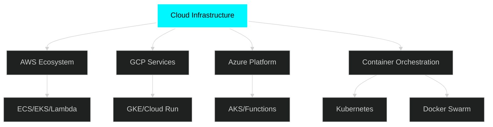
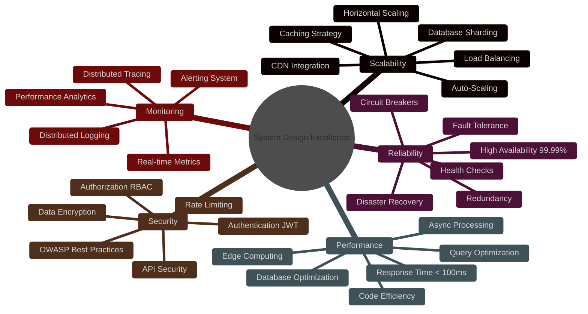
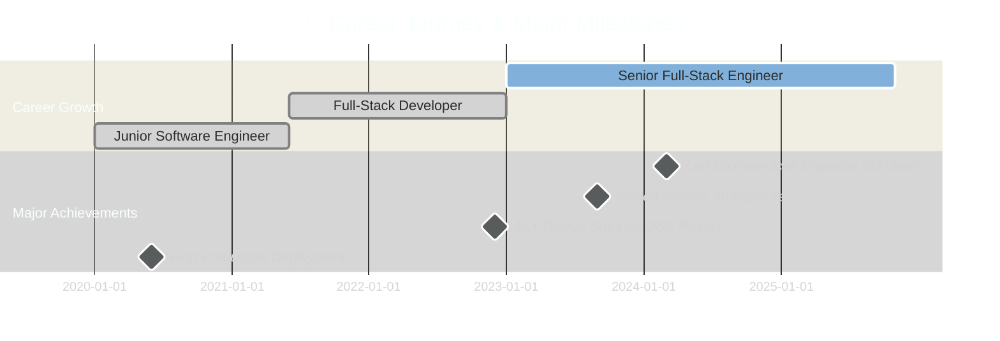

```mermaid
%%{init: {'theme':'dark', 'themeVariables': { 'primaryColor':'#00F7FF','primaryTextColor':'#fff','primaryBorderColor':'#00F7FF','lineColor':'#00F7FF','secondaryColor':'#1a1a1a','tertiaryColor':'#0D1117'}}}%%
graph LR
    A[React Ecosystem] --> B[Next.js SSR/SSG]
    A --> C[React Native Mobile]
    A --> D[State Management]
    B --> E[API Routes]
    B --> F[Edge Functions]
    D --> G[Redux/Zustand]
    style A fill:#00F7FF,stroke:#fff,stroke-width:3px,color:#000
    style B fill:#0D1117,stroke:#00F7FF,stroke-width:2px
    style C fill:#0D1117,stroke:#00F7FF,stroke-width:2px
    style D fill:#0D1117,stroke:#00F7FF,stroke-width:2px
```

```mermaid
%%{init: {'theme':'dark', 'themeVariables': { 'primaryColor':'#00F7FF','primaryTextColor':'#fff','primaryBorderColor':'#00F7FF'}}}%%
graph TB
    A[Data Layer] --> B[SQL Databases]
    A --> C[NoSQL Databases]
    A --> D[Caching Layer]
    B --> E[PostgreSQL]
    B --> F[MySQL]
    C --> G[MongoDB]
    C --> H[DynamoDB]
    D --> I[Redis]
    D --> J[Memcached]
    style A fill:#00F7FF,stroke:#fff,stroke-width:3px,color:#000
    style B fill:#0D1117,stroke:#00F7FF,stroke-width:2px
    style C fill:#0D1117,stroke:#00F7FF,stroke-width:2px
    style D fill:#0D1117,stroke:#00F7FF,stroke-width:2px
```

<div align="center">

<!-- 🔥 EPIC ANIMATED HEADER 🔥 -->


<!-- ⚡ ULTRA DYNAMIC TYPING ANIMATION ⚡ -->
[](https://github.com/peashdasrudra)

<br>

<!-- 💎 NEON GLOW BADGES 💎 -->
<p align="center">
  <a href="https://twitter.com/peashdasrudra">
    
  </a>
  <a href="https://www.linkedin.com/in/peashdasrudra">
    
  </a>
  <a href="https://github.com/peashdasrudra">
    
  </a>
  <a href="mailto:peash@youremail.com">
    
  </a>
  <a href="https://medium.com/@peashdasrudra">
    
  </a>
</p>

<!-- 🔥 EPIC SEPARATOR 🔥 -->


<!-- 📊 LIVE STATS SECTION 📊 -->
<p align="center">
  
  
  
  
</p>

</div>

---

<div align="center">

##  **ABOUT ME** 

</div>


### 🚀 **Senior Full-Stack Engineer | System Architect**

```javascript
const peash = {
    location: "🌍 Khulna, Bangladesh",
    role: "💼 Full-Stack Architect & Cloud Solutions Engineer",
    focus: ["⚡ Performance Optimization", "📊 System Scalability", "🎯 Clean Architecture"],
    mission: "🚀 Crafting high-performance systems that impact millions of lives",
    
    dailyRoutine: () => {
        while(alive) {
            drink("☕ Coffee");
            write("💻 Clean Code");
            optimize("⚡ Performance");
            mentor("👨‍🏫 Developers");
            deploy("🚀 Production");
            sleep("😴 Sometimes..."); 
        }
    },
    
    currentlyMastering: [
        "🦀 Rust for System Programming",
        "🕸️ WebAssembly for Edge Computing", 
        "☸️ Advanced Kubernetes Patterns",
        "🔄 Distributed Systems Design"
    ],
    
    bigChallenge: "Building a real-time system for 100M concurrent users 🎯",
    funFact: "I debug production issues at 3 AM with coffee... and I love it! ☕💻"
};
```

### 💎 **What Drives Me**

<table>
<tr>
<td width="50%">

#### 🎯 **PASSION & EXPERTISE**
```yaml
Core Specializations:
  - ⚡ High-Performance Architecture
  - ☁️  Cloud-Native Applications
  - 🔄 Scalable Microservices
  - 🎨 Developer Experience Excellence

Core Values:
  - ✨ Clean Code Craftsmanship
  - 🏗️  System Design Mastery
  - 🚀 Continuous Innovation
  - 📚 Knowledge Sharing & Mentorship
```

</td>
<td width="50%">

#### 🔥 **CURRENTLY BUILDING**
```yaml
Active Projects:
  - 💼 SaaS Platform (100K+ users)
  - 🤝 Real-time Collaboration Tools
  - 🤖 AI-Powered Developer Tools
  - 🌟 Open Source Libraries

Learning Path 2025:
  - ☸️  Advanced Kubernetes Operators
  - 🌐 Distributed Systems Patterns
  - ⚡ Edge Computing & WebAssembly
  - 🔧 System-Level Optimization
```

</td>
</tr>
</table>

<br clear="right"/>

---

<div align="center">

##  **TECH STACK & EXPERTISE** 


</div>

### 🎨 **FRONTEND MASTERY**

<p align="center">
  
</p>

<div align="center">



</div>

### ⚙️ **BACKEND POWERHOUSE**

<p align="center">
  
</p>

### 🗄️ **DATABASE & CACHING EXPERTISE**

<p align="center">
  
</p>

<div align="center">



</div>

### ☁️ **CLOUD & DEVOPS MASTERY**

<p align="center">
  
</p>

<div align="center">



</div>

### 🛠️ **TOOLS & PLATFORMS**

<p align="center">
  
</p>

<!-- 💫 ANIMATED TECH ICONS 💫 -->
<p align="center">
  
  
  
  
  
  
</p>

---

<div align="center">

##  **GITHUB STATS & ANALYTICS** 


</div>

<div align="center">


</div>

### 🏆 **GITHUB TROPHIES**

<div align="center">


</div>

### 📊 **DETAILED CONTRIBUTION STATS**

<div align="center">


</div>

---

<div align="center">

##  **SKILLS PROFICIENCY MATRIX** 

</div>

<div align="center">

| 🎯 **Skill Domain** | **Technologies & Tools** | **Proficiency Level** |
|:-------------------:|:------------------------|:---------------------:|
| **Frontend Development** | React • Next.js • Vue • TypeScript • Tailwind |  |
| **Backend Development** | Node.js • Python • Go • Rust • GraphQL |  |
| **Database & Caching** | PostgreSQL • MongoDB • Redis • DynamoDB |  |
| **DevOps & Cloud** | Docker • Kubernetes • AWS • Terraform • CI/CD |  |
| **System Architecture** | Microservices • DDD • Event-Driven • CQRS |  |
| **Testing & Quality** | Jest • Playwright • K6 • Cypress • TDD |  |

</div>

---

<div align="center">

##  **SYSTEM DESIGN PHILOSOPHY** 


</div>



<details>
<summary><b>🏗️ Click to expand: Architecture Principles & Patterns</b></summary>

<br>

### 💎 **SOLID Principles**
```yaml
S - Single Responsibility: One class, one responsibility
O - Open/Closed: Open for extension, closed for modification
L - Liskov Substitution: Derived classes must be substitutable
I - Interface Segregation: Many specific interfaces over one general
D - Dependency Inversion: Depend on abstractions, not concretions
```

### 🎯 **Design Patterns Mastery**
- **Microservices Architecture** - Independently deployable services
- **Event-Driven Design** - Asynchronous communication patterns
- **CQRS & Event Sourcing** - Command Query Responsibility Segregation
- **Domain-Driven Design** - Business logic at the core
- **Saga Pattern** - Distributed transactions management
- **API Gateway Pattern** - Single entry point for microservices
- **Circuit Breaker** - Fault tolerance and resilience

### ⚡ **Performance Optimization Patterns**
- **Database Sharding** - Horizontal partitioning for scale
- **Read Replicas** - Distribute read load across replicas
- **Multi-Layer Caching** - Redis, CDN, Application caching
- **Async Processing** - Message queues for heavy operations
- **Connection Pooling** - Efficient resource management
- **Lazy Loading** - Load resources only when needed

</details>

---

<div align="center">

##  **PROFESSIONAL IMPACT** 


</div>



### 💥 **IMPACT METRICS**

<div align="center">

<table>
<tr>
<td align="center" width="20%">
<br>
<br>
<b>Users Served</b>
</td>
<td align="center" width="20%">
<br>
<br>
<b>Lines of Code</b>
</td>
<td align="center" width="20%">
<br>
<br>
<b>Commits (2024)</b>
</td>
<td align="center" width="20%">
<br>
<br>
<b>Projects Deployed</b>
</td>
<td align="center" width="20%">
<br>
<br>
<b>Tech Talks</b>
</td>
</tr>
</table>

### 🎖️ **CERTIFICATIONS & HONORS**

<table>
<tr>
<td align="center" width="25%">
<br>
<br>
<b>Professional Level</b>
</td>
<td align="center" width="25%">
<br>
<br>
<b>Certified Administrator</b>
</td>
<td align="center" width="25%">
<br>
<br>
<b>Professional Architect</b>
</td>
<td align="center" width="25%">
<br>
<br>
<b>2024 Champion</b>
</td>
</tr>
</table>

</div>

---

<div align="center">

##  **CODING ACTIVITY & TIME** 


</div>

<div align="center">

### ⏰ **WEEKLY CODING TIME BREAKDOWN**

<!--START_SECTION:waka-->
```text
💻 This Week I Spent My Time On:

TypeScript    12 hrs 30 mins  ████████████░░░░░   45.2%  🔥
JavaScript     8 hrs 15 mins  ████████░░░░░░░░░   29.8%  💪
Python         3 hrs 45 mins  ███░░░░░░░░░░░░░░   13.5%  ⚡
Go             2 hrs 10 mins  ██░░░░░░░░░░░░░░░    7.9%  🚀
Rust           1 hr  5 mins   █░░░░░░░░░░░░░░░░    3.6%  🦀
```
<!--END_SECTION:waka-->


</div>

---

<div align="center">

##  **2025 GOALS & ROADMAP** 


</div>

<table align="center">
<tr>
<td width="33%" valign="top">

### 🎯 **TECHNICAL MASTERY**
```yaml
Goals:
  ✅ Master WebAssembly
  ⬜ Contribute to 3 major OSS
  ⬜ Build production Rust framework
  ✅ Achieve 99.99% uptime SLA
  ⬜ Optimize for sub-100ms latency
  ⬜ Scale system to 100M users

Progress: 
  [████░░░░░░] 40%
```

</td>
<td width="33%" valign="top">

### 📚 **LEARNING & GROWTH**
```yaml
Goals:
  ⬜ Complete System Design course
  ✅ Master Distributed Systems
  ⬜ Advanced K8s patterns
  ⬜ ML fundamentals & AI
  ✅ Deep dive Database internals
  ⬜ WebAssembly & Edge computing

Progress: 
  [████░░░░░░] 40%
```

</td>
<td width="33%" valign="top">

### 🌟 **COMMUNITY IMPACT**
```yaml
Goals:
  ⬜ Speak at 5 conferences
  ⬜ Publish 50 tech articles
  ✅ Mentor 20 developers
  ⬜ Launch product with 10K users
  ⬜ Start tech podcast series
  ⬜ Contribute to Linux kernel

Progress: 
  [██░░░░░░░░] 20%
```

</td>
</tr>
</table>

<div align="center">


</div>

---

<div align="center">

##  **CONNECT & COLLABORATE** 


</div>

<div align="center">

### 💼 **PROFESSIONAL NETWORKS**

<table>
<tr>
<td align="center" width="20%">
<a href="https://twitter.com/peashdasrudra">
<br>

<br><b>@peashdasrudra</b>
</a>
</td>
<td align="center" width="20%">
<a href="https://www.linkedin.com/in/peashdasrudra">
<br>

<br><b>Let's Connect</b>
</a>
</td>
<td align="center" width="20%">
<a href="https://github.com/peashdasrudra">
<br>

<br><b>Follow Me</b>
</a>
</td>
<td align="center" width="20%">
<a href="https://medium.com/@peashdasrudra">
<br>

<br><b>Read My Blog</b>
</a>
</td>
<td align="center" width="20%">
<a href="mailto:peash@youremail.com">
<br>

<br><b>Email Me</b>
</a>
</td>
</tr>
</table>

### 🚀 **OPEN FOR COLLABORATION**

<p align="center">
  
  
  
  
</p>

</div>

---

<div align="center">

## 🐍 **CONTRIBUTION SNAKE EATING MY CONTRIBUTIONS** 🐍

<picture>
  <source media="(prefers-color-scheme: dark)" srcset="https://raw.githubusercontent.com/peashdasrudra/peashdasrudra/output/github-contribution-grid-snake-dark.svg">
  <source media="(prefers-color-scheme: light)" srcset="https://raw.githubusercontent.com/peashdasrudra/peashdasrudra/output/github-contribution-grid-snake.svg">
  
</picture>

</div>

---

<div align="center">

## 💎 **ENGINEERING WISDOM & PRINCIPLES** 💎


### 🎯 **MY CORE ENGINEERING PRINCIPLES**

```typescript
const engineeringPrinciples: Record<string, string> = {
  "KISS": "Keep It Simple, Stupid - Avoid over-engineering at all costs",
  "DRY": "Don't Repeat Yourself - Write reusable, modular code",
  "SOLID": "Object-oriented design principles for maintainable code",
  "TDD": "Test-Driven Development - Write tests first, code later",
  "CleanCode": "Code should read like well-written prose, not puzzles",
  "Performance": "Measure first, optimize what matters, ignore vanity metrics",
  "Security": "Security is not optional, it's a fundamental requirement",
  "Documentation": "Good code explains 'what', great docs explain 'why'",
  
  motto: "Build fast, build right, build to scale, then optimize 🚀"
};
```

</div>

---

<div align="center">

## 💖 **SUPPORT MY WORK** 💖


### ☕ **BUY ME A COFFEE**

<a href="https://www.buymeacoffee.com/peashdasrudra">
  
</a>

### 🌟 **SHOW YOUR SUPPORT**

<p>
  
  
  
</p>


</div>

---

<div align="center">

## 🎨 **DEVELOPER LIFESTYLE & INTERESTS** 🎨

<table>
<tr>
<td width="50%" valign="top">

### 🎯 **WHEN I'M NOT CODING**

```javascript
const lifestyle = {
  coffee: "☕ Specialty coffee enthusiast",
  writing: "📚 Technical blogging & tutorials",
  gaming: "🎮 Strategy & problem-solving games",
  music: "🎸 Lo-fi beats while coding",
  fitness: "🏃 Morning runs for mental clarity",
  travel: "🌍 Exploring tech hubs & conferences",
  reading: "📖 System design & architecture books"
};
```

</td>
<td width="50%" valign="top">

### 💡 **DEV FACTS ABOUT ME**

```yaml
Coding Style:
  - 🌙 Night Owl: Peak performance at 2 AM
  - ⌨️  Mechanical Keyboard enthusiast
  - 🖥️  Triple monitor setup + standing desk
  - 🎧 Noise-canceling headphones essential
  
Philosophy:
  - 📱 Reading 3 tech books per month
  - 🎯 Always working on 5 side projects
  - 🤝 Daily OSS contributions
  - ☕ Coffee-driven development
```

</td>
</tr>
</table>

</div>

---

<div align="center">

## 🏅 **RECENT ACHIEVEMENTS & MILESTONES** 🏅


| 🎯 **Achievement** | 📅 **Date** | 📝 **Impact & Description** |
|:-----------------:|:-----------:|:---------------------------|
| 🚀 **Platform Launch** | Nov 2024 | Launched real-time collaboration platform serving 10K concurrent users |
| 🎤 **KubeCon Speaker** | Oct 2024 | Presented "Scaling Microservices" to 500+ attendees |
| ⭐ **1K GitHub Stars** | Sep 2024 | Open source project reached 1000+ stars milestone |
| 📝 **Published Handbook** | Aug 2024 | Released complete system design guide (500+ pages, 10K downloads) |
| 🏅 **AWS Certified** | Jul 2024 | Achieved Solutions Architect Professional certification |
| 💻 **100-Day Streak** | Jun 2024 | Maintained continuous daily coding contributions |

</div>

---

<div align="center">

## 📊 **ADVANCED GITHUB METRICS** 📊


</div>

---

<div align="center">


### 💙 **THANK YOU FOR VISITING!** 💙


### ⚡ *"Talk is cheap. Show me the code."* – **Linus Torvalds**

<br>

<img src="https://img.shields.io/badge/Made_with-💙_Love_and_☕_Coffee-00F7FF?style=for
