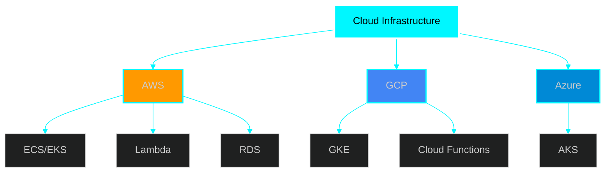
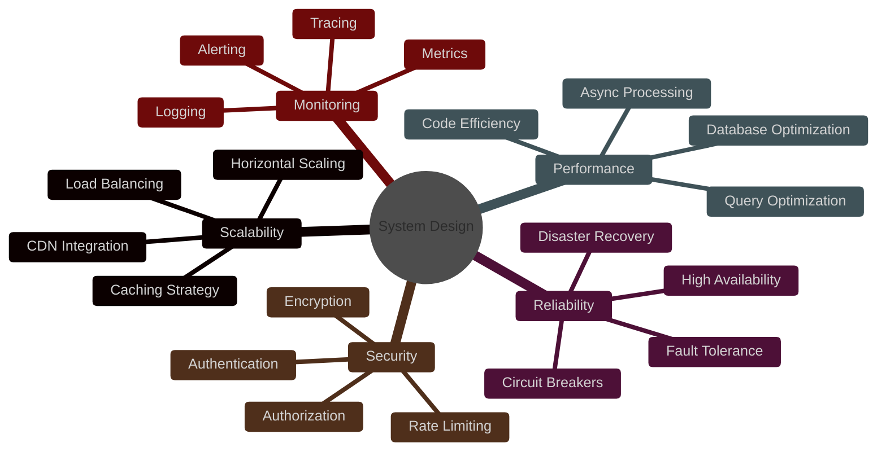
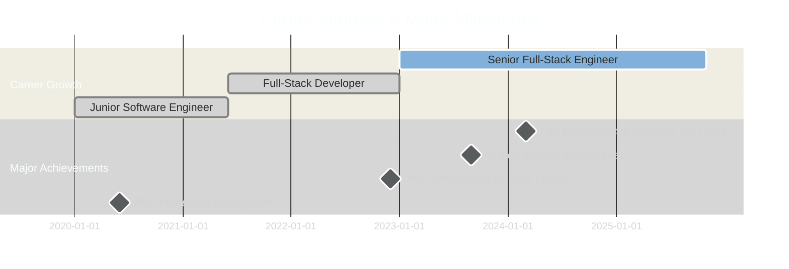

```mermaid
%%{init: {'theme':'dark', 'themeVariables': { 'primaryColor':'#00F7FF','primaryTextColor':'#fff','primaryBorderColor':'#00F7FF','lineColor':'#00F7FF','secondaryColor':'#1a1a1a','tertiaryColor':'#0D1117'}}}%%
graph LR
    A[React Ecosystem] --> B[Next.js]
    A --> C[React Native]
    A --> D[Redux/Zustand]
    B --> E[SSR/SSG]
    B --> F[API Routes]
    style A fill:#00F7FF,stroke:#fff,stroke-width:2px,color:#000
    style B fill:#0D1117,stroke:#00F7FF,stroke-width:2px
    style C fill:#0D1117,stroke:#00F7FF,stroke-width:2px
    style D fill:#0D1117,stroke:#00F7FF,stroke-width:2px
```

<div align="center">

<!-- EPIC ANIMATED HEADER -->


<!-- ULTRA DYNAMIC TYPING ANIMATION -->
[](https://git.io/typing-svg)

<br>

<!-- NEON GLOW BADGES -->
<p align="center">
  <a href="https://twitter.com/peashdasrudra">
    
  </a>
  <a href="https://www.linkedin.com/in/peashdasrudra">
    
  </a>
  <a href="https://github.com/peashdasrudra">
    
  </a>
  <a href="mailto:peash@youremail.com">
    
  </a>
  <a href="https://medium.com/@peashdasrudra">
    
  </a>
</p>

<!-- EPIC SEPARATOR -->


<!-- LIVE STATS SECTION -->
<p align="center">
  
  
  
  
</p>

</div>

---

<div align="center">

##  **ABOUT ME**

</div>


### 🚀 **Senior Full-Stack Engineer | System Architect**

```javascript
const peash = {
    location: "🌍 Khulna, Bangladesh",
    current: "💼 Building Next-Gen Cloud Solutions",
    focus: ["⚡ Performance", "📊 Scale", "🎯 Clean Code"],
    mission: "🚀 Crafting systems that impact millions",
    
    dailyRoutine: () => {
        while(alive) {
            eat();
            code();
            optimizePerformance();
            mentorDevelopers();
            sleep(); // Sometimes...
        }
    },
    
    currentlyLearning: ["Rust", "WebAssembly", "K8s Operators"],
    challenge: "Building a system for 100M concurrent users",
    funFact: "I debug production at 3 AM with coffee ☕"
};
```

### 💎 **What Drives Me**

<table>
<tr>
<td width="50%">

#### 🎯 **PASSION**
```yaml
Specialization:
  - High-Performance Architecture
  - Cloud-Native Applications
  - Scalable Microservices
  - Developer Experience

Values:
  - Clean Code Excellence
  - System Design Mastery
  - Continuous Innovation
  - Knowledge Sharing
```

</td>
<td width="50%">

#### 🔥 **BUILDING NOW**
```yaml
Projects:
  - SaaS Platform (100K users)
  - Real-time Collaboration Tool
  - AI-Powered Dev Tools
  - Open Source Libraries

Learning:
  - Advanced K8s Patterns
  - Distributed Systems
  - Edge Computing
  - System Optimization
```

</td>
</tr>
</table>

<br clear="right"/>

---

<div align="center">

##  **TECH ARSENAL**


</div>

### 🎨 **FRONTEND MASTERY**

<p align="center">
  
</p>

<div align="center">



</div>

### ⚙️ **BACKEND POWERHOUSE**

<p align="center">
  
</p>

### 🗄️ **DATABASE EXPERTISE**

<p align="center">
  
</p>

### ☁️ **CLOUD & DEVOPS MASTERY**

<p align="center">
  
</p>

<div align="center">



</div>

### 🛠️ **TOOLS & PLATFORMS**

<p align="center">
  
</p>

<!-- ANIMATED TECH ICONS -->
<p align="center">
  
  
  
  
  
  
  
  
</p>

---

<div align="center">

##  **SYSTEM DESIGN PHILOSOPHY**

</div>



<details>
<summary><b>🏗️ Architecture Principles (Click to expand)</b></summary>

<br>

### 💎 **SOLID Principles**
- **S**ingle Responsibility
- **O**pen/Closed
- **L**iskov Substitution
- **I**nterface Segregation
- **D**ependency Inversion

### 🎯 **Design Patterns**
- Microservices Architecture
- Event-Driven Design
- CQRS & Event Sourcing
- Domain-Driven Design
- Saga Pattern

### ⚡ **Performance Patterns**
- Database Sharding
- Read Replicas
- Caching Layers (Redis)
- CDN Strategy
- Async Processing

</details>

---

<div align="center">

##  **FEATURED PROJECTS**


</div>

<div align="center">

<table>
<tr>
<td width="50%" valign="top">

### 🚀 **Real-Time Collaboration Platform**

<a href="https://github.com/peashdasrudra/awesome-project-1">
  
</a>

**🎯 Tech Stack**
```yaml
Frontend: React, TypeScript, TailwindCSS
Backend: Node.js, WebSocket, Redis
Database: PostgreSQL, MongoDB
DevOps: Docker, Kubernetes, AWS
```

**✨ Highlights**
- 🎯 10K concurrent users
- ⚡ 500ms avg latency
- 🔒 E2E encryption
- 📊 Real-time sync

<p align="center">
  
  
  
</p>

</td>
<td width="50%" valign="top">

### 🎯 **Serverless API Gateway**

<a href="https://github.com/peashdasrudra/awesome-project-2">
  
</a>

**🎯 Tech Stack**
```yaml
Framework: Next.js 14, TypeScript
Backend: AWS Lambda, API Gateway
Database: DynamoDB, S3
IaC: Terraform, CloudFormation
```

**✨ Highlights**
- 🌐 0-100K auto-scaling
- 💰 90% cost reduction
- 🚀 Sub-50ms p99
- 📈 Built-in throttling

<p align="center">
  
  
  
</p>

</td>
</tr>
<tr>
<td width="50%" valign="top">

### 💡 **AI-Powered Code Analyzer**

<a href="https://github.com/peashdasrudra/project-3">
  
</a>

**🎯 Tech Stack**
```yaml
Backend: Go, Python, FastAPI
ML: TensorFlow, PyTorch
Orchestration: Kubernetes, gRPC
Monitoring: Prometheus, Grafana
```

**✨ Highlights**
- 🤖 ML-based detection
- ⚡ 80% faster analysis
- 🎯 Performance insights
- 🔍 15+ languages

<p align="center">
  
  
</p>

</td>
<td width="50%" valign="top">

### 🔥 **Distributed Task Scheduler**

<a href="https://github.com/peashdasrudra/project-4">
  
</a>

**🎯 Tech Stack**
```yaml
Core: Rust, Tokio Runtime
Queue: RabbitMQ, Redis
Protocol: gRPC, Protocol Buffers
Monitoring: Prometheus, Grafana
```

**✨ Highlights**
- ⏰ ms precision scheduling
- 🔄 Auto retry logic
- 📊 Live dashboard
- 🛡️ At-least-once exec

<p align="center">
  
  
</p>

</td>
</tr>
</table>

</div>

---

<div align="center">

##  **GITHUB ANALYTICS**


</div>

<div align="center">


</div>

<div align="center">


</div>

<div align="center">


</div>

### 🏆 **GITHUB TROPHIES**

<div align="center">

[](https://github.com/ryo-ma/github-profile-trophy)

</div>

### 📊 **DETAILED CONTRIBUTION STATS**

<div align="center">


</div>

---

<div align="center">

##  **PROFESSIONAL IMPACT**


</div>



<div align="center">

### 💥 **IMPACT METRICS**

<table>
<tr>
<td align="center" width="20%">
<br>
<br>
<b>Users Served</b>
</td>
<td align="center" width="20%">
<br>
<br>
<b>Lines of Code</b>
</td>
<td align="center" width="20%">
<br>
<br>
<b>Commits (2024)</b>
</td>
<td align="center" width="20%">
<br>
<br>
<b>Projects Deployed</b>
</td>
<td align="center" width="20%">
<br>
<br>
<b>Tech Talks</b>
</td>
</tr>
</table>

### 🎖️ **CERTIFICATIONS & HONORS**

<table>
<tr>
<td align="center" width="25%">
<br>
<br>
<b>Professional Level</b>
</td>
<td align="center" width="25%">
<br>
<br>
<b>Certified Administrator</b>
</td>
<td align="center" width="25%">
<br>
<br>
<b>Professional Architect</b>
</td>
<td align="center" width="25%">
<br>
<br>
<b>2024 Champion</b>
</td>
</tr>
</table>

</div>

---

<div align="center">

##  **SKILLS MATRIX**

</div>

<div align="center">

| 🎯 **Skill Domain** | **Technologies** | **Proficiency** |
|:------------------:|:-----------------|:---------------:|
| **Frontend** | React • Next.js • Vue • TypeScript |  |
| **Backend** | Node.js • Python • Go • Rust |  |
| **Database** | PostgreSQL • MongoDB • Redis • DynamoDB |  |
| **DevOps** | Docker • Kubernetes • AWS • CI/CD |  |
| **Architecture** | Microservices • System Design • DDD |  |
| **Testing** | Jest • Playwright • K6 • Cypress |  |

</div>

---

<div align="center">

##  **CODING ACTIVITY**


</div>

<div align="center">

### ⏰ **WEEKLY CODING TIME**

<!--START_SECTION:waka-->
```text
TypeScript    12 hrs 30 mins  ████████████░░░░░   45.2%  🔥
JavaScript     8 hrs 15 mins  ████████░░░░░░░░░   29.8%  💪
Python         3 hrs 45 mins  ███░░░░░░░░░░░░░░   13.5%  ⚡
Go             2 hrs 10 mins  ██░░░░░░░░░░░░░░░    7.9%  🚀
Rust           1 hr  5 mins   █░░░░░░░░░░░░░░░░    3.6%  🦀
```
<!--END_SECTION:waka-->

</div>

<div align="center">


</div>

---

<div align="center">

##  **2025 ROADMAP**


</div>

<table align="center">
<tr>
<td width="33%" valign="top">

### 🎯 **TECHNICAL GOALS**
```yaml
✅ Master WebAssembly
⬜ Contribute to 3 OSS projects
⬜ Build Rust framework
✅ Achieve 99.99% uptime
⬜ Sub-100ms latency

Progress: 40% ████░░░░░░
```

</td>
<td width="33%" valign="top">

### 📚 **LEARNING GOALS**
```yaml
⬜ System Design mastery
✅ Distributed Systems
⬜ K8s operators
⬜ ML fundamentals
✅ Database internals

Progress: 40% ████░░░░░░
```

</td>
<td width="33%" valign="top">

### 🌟 **COMMUNITY GOALS**
```yaml
⬜ 5 conference talks
⬜ 50 technical articles
✅ Mentor 20 developers
⬜ 10K user product
⬜ Start tech podcast

Progress: 20% ██░░░░░░░░
```

</td>
</tr>
</table>

<div align="center">


</div>

---

<div align="center">

##  **CONNECT WITH ME**


</div>

<div align="center">

### 💼 **PROFESSIONAL NETWORKS**

<table>
<tr>
<td align="center" width="20%">
<a href="https://twitter.com/peashdasrudra">
<br>

<br><b>@peashdasrudra</b>
</a>
</td>
<td align="center" width="20%">
<a href="https://www.linkedin.com/in/peashdasrudra">
<br>

<br><b>Connect</b>
</a>
</td>
<td align="center" width="20%">
<a href="https://github.com/peashdasrudra">
<br>

<br><b>Follow</b>
</a>
</td>
<td align="center" width="20%">
<a href="https://medium.com/@peashdasrudra">
<br>

<br><b>Read</b>
</a>
</td>
<td align="center" width="20%">
<a href="mailto:peash@youremail.com">
<br>

<br><b>Contact</b>
</a>
</td>
</tr>
</table>

### 🚀 **OPEN FOR COLLABORATION**

<p align="center">
  
  
  
  
</p>

</div>

---

<div align="center">

## 🐍 **CONTRIBUTION SNAKE**

<picture>
  <source media="(prefers-color-scheme: dark)" srcset="https://raw.githubusercontent.com/peashdasrudra/peashdasrudra/output/github-contribution-grid-snake-dark.svg">
  <source media="(prefers-color-scheme: light)" srcset="https://raw.githubusercontent.com/peashdasrudra/peashdasrudra/output/github-contribution-grid-snake.svg">
  
</picture>

</div>

---

<div align="center">

## 💎 **CODING WISDOM**


### 🎯 **ENGINEERING PRINCIPLES**

```typescript
const engineeringPrinciples = {
  KISS: "Keep It Simple, Stupid - Avoid over-engineering",
  DRY: "Don't Repeat Yourself - Write reusable code",
  SOLID: "Object-oriented design excellence",
  TDD: "Test-Driven Development for reliability",
  CleanCode: "Code should read like well-written prose",
  Performance: "Optimize what matters, measure everything",
  
  motto: "Build fast, build right, build to scale 🚀"
};
```

</div>

---

<div align="center">

## 💖 **SUPPORT MY WORK**


### ☕ **BUY ME A COFFEE**

<a href="https://www.buymeacoffee.com/peashdasrudra">
  
</a>

### 🌟 **STAR MY REPOSITORIES**

<p>
  
  
</p>


</div>

---

<div align="center">

## 🎨 **FUN FACTS & HOBBIES**

<table>
<tr>
<td width="50%" valign="top">

### 🎯 **WHEN I'M NOT CODING**

```javascript
const hobbies = {
  coffee: "☕ Trying new brewing methods",
  writing: "📚 Tech blogging & tutorials",
  gaming: "🎮 Strategy & puzzle games",
  music: "🎸 Lo-fi while coding",
  fitness: "🏃 Morning runs for clarity",
  travel: "🌍 Exploring tech hubs"
};
```

</td>
<td width="50%" valign="top">

### 💡 **RANDOM DEV FACTS**

```yaml
Coding Style:
  - 🌙 Night Owl (2 AM = Peak Performance)
  - ⌨️  Mechanical Keyboard Enthusiast
  - 🖥️  Dual Monitors + Standing Desk
  
Learning:
  - 📱 3 Tech Books per Month
  - 🎯 5 Active Side Projects
  - 🤝 Daily OSS Contributions
```

</td>
</tr>
</table>

</div>

---

<div align="center">

## 🏅 **RECENT ACHIEVEMENTS**


| 🎯 **Achievement** | 📅 **Date** | 📝 **Description** |
|:-----------------:|:-----------:|:-------------------|
| 🚀 **Major Launch** | Nov 2024 | Real-time platform serving 10K concurrent users |
| 🎤 **KubeCon Speaker** | Oct 2024 | Talked about scaling microservices architecture |
| ⭐ **1K GitHub Stars** | Sep 2024 | Open source project reached major milestone |
| 📝 **Published Guide** | Aug 2024 | Complete system design handbook (500+ pages) |
| 🏅 **AWS Certified** | Jul 2024 | Solutions Architect Professional certification |
| 💻 **100 Day Streak** | Jun 2024 | Continuous daily coding contributions |

</div>

---

<div align="center">

## 📊 **GITHUB METRICS**


![Metrics](https://metrics.lecoq.io/peashdasrudra?template=classic&base=header%2C%20activity%2C%20community%2C%20repositories%2C%20metadata&base.indepth=false&base.hireable=false&base.skip=false&isocalendar=1&languages=1&lines=1&achievements=1&notable=1&discussions=1&followup=1&reactions=1&people=1&stargazers=1&code=1&activity=1&posts=1&isocalendar.duration=half-year&languages.limit=8&languages.threshold=0%25&languages.other=false&languages.colors=github&languages.sections=most-used&languages.indepth=false&languages.analysis.timeout=15&languages.analysis.timeout.repositories=7.5&languages.categories=markup%2C%20programming&languages.recent.categories=markup%2C%20programming&languages.recent.load=300&languages.recent.days=14&achievements.threshold=C&achievements.secrets=true&achievements.display=detailed&achievements.limit=0&notable.from=organization&notable.repositories=false&notable.indepth=false&notable.types=commit&discussions.categories=true&discussions.categories.limit=0&followup.sections=repositories&followup.indepth=false&reactions.limit=200&reactions.limit.issues=100&reactions.limit.discussions=100&reactions.limit.discussions.comments=100&reactions.days=14&reactions.display=absolute&people.limit=24&people.identicons=false&people.identicons.hide=false&people.size=28&people.types=followers%2C%20following&people.shuffle=false&stargazers.charts=false&stargazers.charts.type=classic&stargazers.worldmap=false&stargazers.worldmap.token=NOT_A_TOKEN&code.lines=12&code.load=400&code.days=3&code.visibility=public&activity.limit=5&activity.load=300&activity.days=14&activity.visibility=all&activity.timestamps=false&activity
