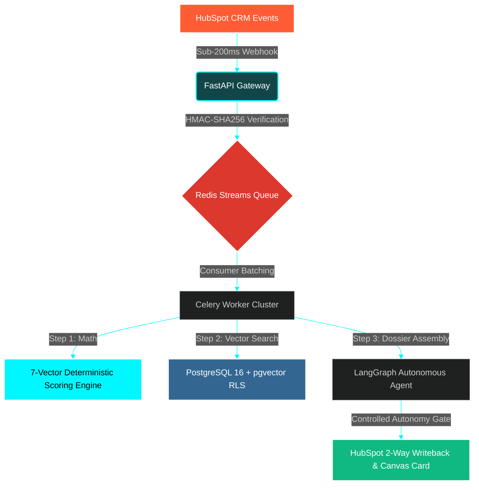

<div align="center">

<!-- 🔥 EPIC ANIMATED CYBERPUNK HEADER 🔥 -->


<!-- ⚡ ULTRA DYNAMIC TYPING SVG ⚡ -->
[](https://github.com/peashdasrudra)

<br>

<!-- 💎 NEON GLOW BADGES & VERIFIED SOCIALS 💎 -->
<p align="center">
  <a href="https://dealsense.peash.tech">
    
  </a>
  <a href="https://dealsense.peash.tech/agency">
    
  </a>
  <a href="https://linkedin.com/in/peashdasrudra">
    
  </a>
  <a href="https://twitter.com/peashdasrudra">
    
  </a>
  <a href="mailto:peashdasrudra@gmail.com">
    
  </a>
</p>

<!-- 📊 LIVE TELEMETRY COUNTERS 📊 -->
<p align="center">
  
  
  
  
</p>

<!-- 🔥 EPIC NEON SEPARATOR 🔥 -->


</div>

---

<!-- 🏆 FLAGSHIP SHOWCASE: DEALSENSE 🏆 -->
## 🌟 Flagship Engineering System: [DealSense](https://github.com/peashdasrudra/DealSense)
### **Autonomous HubSpot-Native Revenue Intelligence & Deal Risk Engine**

> *"Most AI CRM tools slap an LLM prompt on deal records and hallucinate win rates. DealSense is engineered differently: deterministic 7-vector mathematical scoring, sub-200ms streaming ingestion, and cryptographic multi-tenant isolation."*

<div align="center">

<a href="https://www.loom.com/share/36fa0417cc9a47e1b08ef2091a304c5f">
  
</a>

<br><br>

[](https://www.loom.com/share/0fa494403b584e51a988e5bf7474b82d)
[-124548?style=for-the-badge&logo=loom&logoColor=white)](https://www.loom.com/share/36fa0417cc9a47e1b08ef2091a304c5f)
[](https://dealsense.peash.tech)
[](https://dealsense.peash.tech/agency)
[](https://github.com/peashdasrudra/DealSense)

</div>

<br>

<table>
<tr>
<td width="52%" valign="top">

#### 🎯 **Architectural Breakthroughs**
- **Sub-200ms Ingestion Pipeline**: HMAC-SHA256 authenticated FastAPI gateways ingest high-frequency HubSpot CRM events directly into distributed Redis Streams.
- **Deterministic 7-Vector Math**: Stage velocity, engagement decay, economic buyer silence, and date slip frequency computed mathematically before generative LLM nodes receive context.
- **Enterprise Multi-Tenancy**: PostgreSQL 16 + pgvector partitioned with hardware-enforced **Row-Level Security (RLS)** and AES-256-GCM token encryption.
- **Native HubSpot Canvas UI**: Embedded directly inside HubSpot CRM deal records with 2-way writeback and 1-click human approval gates.

</td>
<td width="48%" valign="top">

#### 💼 **Core Tech Stack**
```yaml
Backend & Streaming:
  - Python 3.14+ | FastAPI (Async REST & SSE)
  - Celery Worker Hub | Redis Streams 7.x
Data & Vectors:
  - PostgreSQL 16 | pgvector (HNSW Indexing)
  - Strict Row-Level Security (Tenant Isolation)
Frontend & Extensions:
  - React 18.3 | TypeScript 5.5 | Vite
  - HubSpot Canvas UI (#124548 / #FF5C35)
AI & Reasoning:
  - LangGraph 7-Node Autonomous Dossier Graph
  - Hybrid RRF (Dense Vector + BM25 Sparse Search)
```

</td>
</tr>
</table>

---

<div align="center">

##  **ABOUT THE ARCHITECT** 

</div>

```typescript
const leadArchitect = {
  name: "Peash Das Rudra",
  role: "AI & Distributed Systems Architect | Founder @ AiXpertLabs",
  location: "Khulna, Bangladesh 🌍",
  engineeringDoctrine: "Deterministic Mathematics Before Generative AI ⚡",
  
  specializations: [
    "High-Throughput CRM Telemetry & Event Streaming",
    "HubSpot Native Apps & React Canvas Extensions",
    "Multi-Tenant PostgreSQL Row-Level Security (RLS)",
    "Distributed Redis Streams & Celery Worker Hubs",
    "Hybrid Vector Search (HNSW + Reciprocal Rank Fusion)"
  ],
  
  commercialOfferings: {
    pilotRiskAudit: "$99 — 48h Full CRM Pipeline Risk Audit & Dossier",
    bespokeDeployment: "$1,500 — Full FastAPI/Redis/PostgreSQL Source Code Handover",
    agencyFleetLicense: "$3,500 — White-Label Unlimited Multi-Tenant Agency Fleet"
  },
  
  superpower: "Writing verifiable, test-backed code (48/48 passing) that handles production load without 3 AM panics ☕"
};
```

---

<div align="center">

##  **TECHNICAL WEAPONRY & EXPERTISE** 

</div>

### 🧠 **AI ENGINEERING & AGENTIC WORKFLOWS**
<p align="center">
  
</p>
<p align="center">
  <b>LangGraph Multi-Agent Workflows</b> • <b>Deterministic Scoring Engines</b> • <b>pgvector HNSW Embedding Search</b> • <b>RRF Hybrid Search</b> • <b>MEDDICC Fact Extraction</b> • <b>LLM Guardrails & Structured Output</b>
</p>

### ⚙️ **DISTRIBUTED SYSTEMS & BACKEND INGESTION**
<p align="center">
  
</p>
<p align="center">
  <b>Sub-200ms Webhook Gateways</b> • <b>Redis Streams & Consumer Groups</b> • <b>Celery Async Pipelines</b> • <b>HMAC-SHA256 Signature Auth</b> • <b>PostgreSQL Row-Level Security (RLS)</b> • <b>AES-256-GCM Token Encryption</b>
</p>

### 🎨 **FRONTEND & HUBSPOT CANVAS ARCHITECTURE**
<p align="center">
  
</p>
<p align="center">
  <b>HubSpot Embedded Canvas CRM Cards</b> • <b>React 18 & TypeScript 5.5</b> • <b>Interactive Video/Telemetry Flow UI</b> • <b>Multi-Tenant Portal Switching</b> • <b>Zero-Overflow Mobile First Layouts</b> • <b>Framer Motion Glassmorphism</b>
</p>

### ☁️ **DEVOPS & PRODUCTION CLOUD INFRASTRUCTURE**
<p align="center">
  
</p>
<p align="center">
  <b>Docker & Multi-Stage Containers</b> • <b>GitHub Actions CI/CD (100% Passing Test Suites)</b> • <b>PostgreSQL 16 pgvector Migrations</b> • <b>Automated Pytest Coverage</b> • <b>Zero-Downtime Production Releases</b>
</p>

---

<div align="center">

## 🏛️ **DISTRIBUTED INGESTION & DATAFLOW TOPOLOGY**


```mermaid
%%{init: {'theme':'dark', 'themeVariables': { 'primaryColor':'#00F7FF','primaryTextColor':'#fff','primaryBorderColor':'#00F7FF','lineColor':'#00F7FF','secondaryColor':'#1a1a1a','tertiaryColor':'#0D1117'}}}%%
graph TD
    A[HubSpot CRM Events] -->|Sub-200ms Webhook| B(FastAPI Gateway)
    B -->|HMAC-SHA256 Verification| C{Redis Streams Queue}
    C -->|Consumer Batching| D[Celery Worker Cluster]
    D -->|Step 1: Math| E[7-Vector Deterministic Scoring Engine]
    D -->|Step 2: Vector Search| F[PostgreSQL 16 + pgvector RLS]
    D -->|Step 3: Dossier Assembly| G[LangGraph Autonomous Agent]
    G -->|Controlled Autonomy Gate| H[HubSpot 2-Way Writeback & Canvas Card]
    style A fill:#FF5C35,stroke:#fff,stroke-width:2px,color:#fff
    style B fill:#124548,stroke:#00F7FF,stroke-width:2px,color:#fff
    style C fill:#DC382D,stroke:#fff,stroke-width:2px,color:#fff
    style E fill:#00F7FF,stroke:#fff,stroke-width:2px,color:#000
    style F fill:#336791,stroke:#fff,stroke-width:2px,color:#fff
    style H fill:#10b981,stroke:#fff,stroke-width:2px,color:#fff
```

</div>

---

<div align="center">

##  **GITHUB TELEMETRY & STATS** 

<br>


<br>


</div>

---

<div align="center">

## 🎯 **SKILLS PROFICIENCY MATRIX**

</div>

<div align="center">

| 🎯 **Engineering Domain** | **Technologies & Architecture** | **Mastery Index** |
|:-------------------:|:------------------------|:---------------------:|
| **AI Systems & LLMs** | LangGraph • pgvector • RRF Hybrid Search • Guardrails |  |
| **Distributed Backend** | Python 3.14 • FastAPI • Celery • Redis Streams |  |
| **Database & Multi-Tenancy**| PostgreSQL 16 • Row-Level Security (RLS) • HNSW |  |
| **Frontend & CRM Cards** | React 18 • TypeScript 5.5 • HubSpot Canvas • Vite |  |
| **DevOps & Infrastructure** | Docker • GitHub Actions CI/CD • Linux • Nginx |  |

</div>

---

<div align="center">

## 💎 **CORE ARCHITECTURAL DOCTRINE**

<table width="100%">
<tr>
<td width="25%" align="center">
<h3>🧮</h3>
<b>Math Before LLMs</b>
<p>Never let an unconstrained LLM guess a metric when deterministic mathematics can compute it with 100% reproducibility.</p>
</td>
<td width="25%" align="center">
<h3>⚡</h3>
<b>Sub-200ms P99 SLA</b>
<p>CRM integrations must ingest events instantly via asynchronous streaming queues to eliminate dropped webhooks under burst spikes.</p>
</td>
<td width="25%" align="center">
<h3>🛡️</h3>
<b>Strict Tenant RLS</b>
<p>Multi-tenant data isolation must be enforced at the database engine level (PostgreSQL RLS), never entrusted to application code alone.</p>
</td>
<td width="25%" align="center">
<h3>🚦</h3>
<b>Controlled Autonomy</b>
<p>AI agents propose, analyze, and draft. Human revenue leaders verify and approve before CRM records ever mutate.</p>
</td>
</tr>
</table>

</div>

---

<div align="center">

## 🐍 **CONTRIBUTION SNAKE EATING MY COMMITS** 🐍

<picture>
  <source media="(prefers-color-scheme: dark)" srcset="https://raw.githubusercontent.com/peashdasrudra/peashdasrudra/output/github-contribution-grid-snake-dark.svg">
  <source media="(prefers-color-scheme: light)" srcset="https://raw.githubusercontent.com/peashdasrudra/peashdasrudra/output/github-contribution-grid-snake.svg">
  
</picture>

</div>

---

<div align="center">

## 🤝 **LET'S BUILD SOMETHING EXTRAORDINARY**

Whether you need a **Bespoke HubSpot AI App**, a **Sub-200ms High-Throughput Event Engine**, or a **Fractional Distributed Systems Architect**:

<br>

<a href="mailto:peashdasrudra@gmail.com">
  
</a>
<a href="https://dealsense.peash.tech/case-study">
  
</a>
<a href="https://linkedin.com/in/peashdasrudra">
  
</a>

<br><br>

<p align="center">
  
  
  
</p>

<br>


### ⚡ *"Talk is cheap. Show me the code."* — **Linus Torvalds**

<br>


</div>
