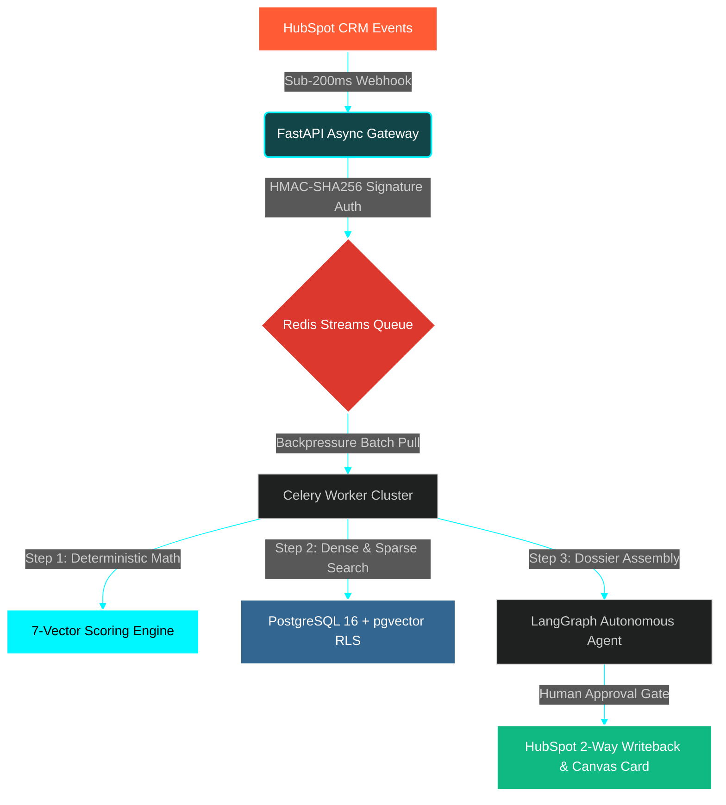
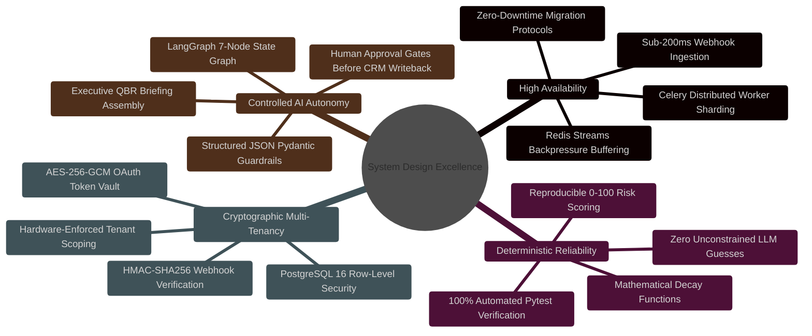
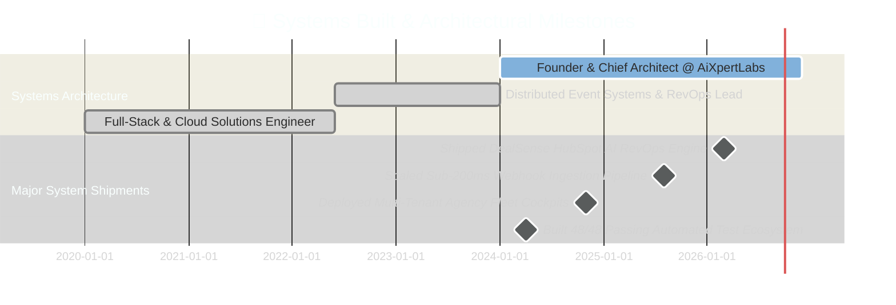

<div align="center">

<!-- 🔥 ABSOLUTE TOP 1% CYBER-TEAL & HUBSPOT FLAME WAVING HEADER BANNER 🔥 -->


<!-- ⚡ ULTRA DYNAMIC TERMINAL TYPING ANIMATION ⚡ -->
[](https://github.com/peashdasrudra)

<br>

<!-- 💎 NEON GLOW BADGES & VERIFIED CHANNELS 💎 -->
<p align="center">
  <a href="https://dealsense.peash.tech">
    
  </a>
  <a href="https://dealsense.peash.tech/agency">
    
  </a>
  <a href="https://linkedin.com/in/peashdasrudra">
    
  </a>
  <a href="https://twitter.com/peashdasrudra">
    
  </a>
  <a href="mailto:peashdasrudra@gmail.com">
    
  </a>
</p>

<!-- 📊 ARCHITECTURAL TELEMETRY STATUS HUD 📊 -->
<p align="center">
  
  
  
  
  
</p>

<!-- 🔥 EPIC GLOWING LASER SEPARATOR GIF 🔥 -->


</div>

---

<!-- 🚀 ABOUT THE ARCHITECT (SPLIT-HERO WITH ANIMATED DEVELOPER) 🚀 -->
<div align="center">

##  **ABOUT THE ARCHITECT** 

</div>


### 🚀 **Senior AI & Distributed Systems Architect | Founder @ AiXpertLabs**

```typescript
const leadArchitect = {
  name: "Peash Das Rudra",
  title: "AI & Distributed Systems Architect | Founder @ AiXpertLabs",
  location: "Khulna, Bangladesh 🌍",
  doctrine: "Deterministic Mathematics Before Generative AI ⚡",
  
  coreEngineeringDisciplines: [
    "High-Throughput CRM Telemetry & Event Ingestion (Sub-200ms)",
    "HubSpot Native App & React Canvas Sidebar Cards",
    "Multi-Tenant PostgreSQL 16 Row-Level Security (RLS)",
    "Distributed Redis Streaming & Celery Backpressure Queues",
    "Deterministic 7-Vector Deal Risk Scoring Algorithms",
    "LangGraph Autonomous Multi-Agent Workflows & Hybrid RAG"
  ],
  
  dailyExecutionLoop: () => {
    while (inBusiness) {
      ingest("⚡ Webhook Event Bursts");
      verifySignature("🔒 HMAC-SHA256");
      calculate("🧮 Deterministic Math");
      isolateTenant("🛡️ PostgreSQL RLS");
      render("🎨 React 18 Canvas Deck");
      deploy("🚀 Production");
    }
  },
  
  superpower: "Writing verifiable, test-backed code (48/48 passing) that handles production load without 3 AM panics ☕"
};
```

### 💎 **What Drives My Craft**

<table>
<tr>
<td width="50%" valign="top">

#### 🎯 **PASSION & SYSTEM CRAFT**
```yaml
Core Competencies:
  - ⚡ Sub-200ms Asynchronous Ingestion
  - 🤖 Autonomous Agentic Workflow Systems
  - 🧩 Native HubSpot Canvas CRM Extensions
  - 🛡️ Strict Database Row-Level Security
  - 📊 Monte Carlo Risk Simulations

Engineering Principles:
  - 🧮 Math Before LLMs (Zero Hallucinations)
  - ✨ Clean Monorepo Architecture
  - 🧪 100% Automated Test Passing (48/48)
  - 🔒 Controlled Autonomy with Approval Gates
```

</td>
<td width="50%" valign="top">

#### 🔥 **ACTIVE DEPLOYMENTS & INNOVATION**
```yaml
Flagship Systems:
  - 🎯 DealSense (dealsense.peash.tech)
  - 🏢 Agency Fleet ($300K ARR Arbitrage Hub)
  - 🧩 Embedded HubSpot CRM Canvas Extension
  - 📑 1-Click Executive PDF Briefing Exporter

Focus Areas 2025:
  - 🧠 Hybrid Sparse-Dense Vector Retrieval (RRF)
  - ⚡ Redis Streams 7.x Cluster Consumer Sharding
  - 🛡️ Enterprise White-Label Multi-Tenant Fleets
  - 📈 Predictive Revenue Telemetry & Remediation
```

</td>
</tr>
</table>

<br clear="right"/>

<!-- 🔥 EPIC GLOWING LASER SEPARATOR GIF 🔥 -->
<div align="center">

</div>

---

<!-- 🏆 FLAGSHIP SHOWCASE: DEALSENSE IN MACOS COMMAND CENTER WINDOW 🏆 -->
<div align="center">

## 🌟 **FEATURED FLAGSHIP SYSTEM: [DEALSENSE](https://github.com/peashdasrudra/DealSense)**
### **Autonomous HubSpot-Native Revenue Intelligence & Deal Risk Engine**

> *"Most AI CRM tools slap an LLM prompt on deal records and hallucinate win rates. DealSense is engineered differently: deterministic 7-vector mathematical scoring, sub-200ms streaming ingestion, and cryptographic multi-tenant isolation."*

<br>

<!-- Simulated macOS Dark Command Deck Window -->
<table width="100%" style="border-collapse: collapse; background: #092124; border-radius: 14px; border: 1.5px solid rgba(0, 247, 255, 0.4); overflow: hidden; box-shadow: 0 20px 60px rgba(0, 247, 255, 0.2);">
  <tr style="background: #0d1117;">
    <td style="padding: 10px 16px; border-bottom: 1px solid rgba(255, 255, 255, 0.1);">
      <span style="color: #ff5f56; font-size: 14px;">●</span>&nbsp;
      <span style="color: #ffbd2e; font-size: 14px;">●</span>&nbsp;
      <span style="color: #27c93f; font-size: 14px;">●</span>
      &nbsp;&nbsp;&nbsp;<b><code style="color: #00F7FF;">dealsense-telemetry-engine — bash — 1920x894 — sub-200ms streaming</code></b>
    </td>
  </tr>
  <tr>
    <td align="center" style="padding: 0; background: #092124;">
      <a href="https://www.loom.com/share/36fa0417cc9a47e1b08ef2091a304c5f">
        
      </a>
    </td>
  </tr>
</table>

<br>

[](https://www.loom.com/share/0fa494403b584e51a988e5bf7474b82d)
[](https://www.loom.com/share/36fa0417cc9a47e1b08ef2091a304c5f)
[](https://dealsense.peash.tech)
[](https://dealsense.peash.tech/agency)
[](https://github.com/peashdasrudra/DealSense)

</div>

<br>

<table>
<tr>
<td width="52%" valign="top">

#### 🎯 **Architectural Breakthroughs**
- **Sub-200ms Ingestion Pipeline**: HMAC-SHA256 authenticated FastAPI gateways ingest high-frequency HubSpot CRM events directly into distributed Redis Streams.
- **Deterministic 7-Vector Math**: Stage velocity, engagement decay, economic buyer silence, and date slip frequency computed mathematically before generative LLM nodes receive context.
- **Enterprise Multi-Tenancy**: PostgreSQL 16 + pgvector partitioned with hardware-enforced **Row-Level Security (RLS)** and AES-256-GCM token encryption.
- **Native HubSpot Canvas UI**: Embedded directly inside HubSpot CRM deal records with 2-way writeback and 1-click human approval gates.
- **Monte Carlo Revenue Forecaster**: Runs 10,000 statistical iterations comparing commit vs best case vs AI reality.

</td>
<td width="48%" valign="top">

#### 💼 **The Production Tech Stack**
```yaml
Backend & Streaming:
  - Python 3.14+ | FastAPI (Async REST & SSE)
  - Celery Worker Hub | Redis Streams 7.x
Data & Vectors:
  - PostgreSQL 16 | pgvector (HNSW Indexing)
  - Strict Row-Level Security (Tenant Isolation)
Frontend & Extensions:
  - React 18.3 | TypeScript 5.5 | Vite
  - HubSpot Canvas UI (#124548 / #FF5C35)
AI & Reasoning:
  - LangGraph 7-Node Autonomous Dossier Graph
  - Hybrid RRF (Dense Vector + BM25 Sparse Search)
Quality Assurance:
  - 48/48 Passing Pytest Suites (100% Verified)
```

</td>
</tr>
</table>

<!-- 💫 ANIMATED FLOATING TECH ICONS 💫 -->
<p align="center">
  
  
  
  
  
  
</p>

<!-- 🔥 EPIC GLOWING LASER SEPARATOR GIF 🔥 -->
<div align="center">

</div>

---

<!-- 🏛️ DISTRIBUTED INGESTION & DATAFLOW TOPOLOGY 🏛️ -->
<div align="center">

## 🏛️ **DISTRIBUTED INGESTION & DATAFLOW TOPOLOGY**


```mermaid
%%{init: {'theme':'dark', 'themeVariables': { 'primaryColor':'#00F7FF','primaryTextColor':'#fff','primaryBorderColor':'#00F7FF','lineColor':'#00F7FF','secondaryColor':'#1a1a1a','tertiaryColor':'#0D1117'}}}%%
graph TD
    A[HubSpot CRM Events] -->|Sub-200ms Webhook| B(FastAPI Async Gateway)
    B -->|HMAC-SHA256 Signature Auth| C{Redis Streams Queue}
    C -->|Backpressure Batch Pull| D[Celery Worker Cluster]
    D -->|Step 1: Deterministic Math| E[7-Vector Scoring Engine]
    D -->|Step 2: Dense & Sparse Search| F[PostgreSQL 16 + pgvector RLS]
    D -->|Step 3: Dossier Assembly| G[LangGraph Autonomous Agent]
    G -->|Human Approval Gate| H[HubSpot 2-Way Writeback & Canvas Card]
    style A fill:#FF5C35,stroke:#fff,stroke-width:2px,color:#fff
    style B fill:#124548,stroke:#00F7FF,stroke-width:2px,color:#fff
    style C fill:#DC382D,stroke:#fff,stroke-width:2px,color:#fff
    style E fill:#00F7FF,stroke:#fff,stroke-width:2px,color:#000
    style F fill:#336791,stroke:#fff,stroke-width:2px,color:#fff
    style H fill:#10b981,stroke:#fff,stroke-width:2px,color:#fff
```

</div>

---

<!-- 🛠️ TECHNICAL WEAPONRY CATEGORIZED 🛠️ -->
<div align="center">

##  **TECHNICAL WEAPONRY & SYSTEM CRAFT** 

</div>

### 🧠 **AI ENGINEERING & AUTONOMOUS AGENTIC WORKFLOWS**
<p align="center">
  
</p>
<p align="center">
  <b>LangGraph Multi-Agent Systems</b> • <b>Deterministic Scoring Engines</b> • <b>pgvector HNSW Vector Search</b> • <b>Reciprocal Rank Fusion (RRF)</b> • <b>MEDDICC Fact Extraction</b> • <b>Structured JSON Outputs & Strict Pydantic Guardrails</b>
</p>

### ⚙️ **DISTRIBUTED SYSTEMS & STREAMING INGESTION**
<p align="center">
  
</p>
<p align="center">
  <b>Sub-200ms Webhook Gateways</b> • <b>Redis Streams & Consumer Groups</b> • <b>Celery Async Pipelines</b> • <b>HMAC-SHA256 Auth</b> • <b>PostgreSQL Row-Level Security (RLS)</b> • <b>AES-256-GCM Token Encryption</b>
</p>

### 🎨 **FRONTEND & HUBSPOT CANVAS CRM CARDS**
<p align="center">
  
</p>
<p align="center">
  <b>HubSpot Embedded Canvas Extensions</b> • <b>React 18 & TypeScript 5.5</b> • <b>Interactive Telemetry Flow UI</b> • <b>Multi-Tenant Fleet Switching</b> • <b>Zero-Overflow Mobile Viewport Engine</b> • <b>Framer Motion Glassmorphism</b>
</p>

### 🗄️ **DATABASE & HIGH-CONCURRENCY STORAGE**
<p align="center">
  
</p>
<p align="center">
  <b>PostgreSQL 16 + pgvector</b> • <b>Distributed Redis Caching</b> • <b>Connection Pooling (asyncpg / SQLAlchemy 2.0)</b> • <b>Alembic Schema Migrations</b> • <b>MongoDB & Relational Databases</b>
</p>

### ☁️ **DEVOPS & CLOUD PRODUCTION INFRASTRUCTURE**
<p align="center">
  
</p>
<p align="center">
  <b>Multi-Stage Docker Builds</b> • <b>GitHub Actions CI/CD (100% Passing)</b> • <b>AWS ECS / EC2 Deployment</b> • <b>Cloudflare Edge Routing</b> • <b>Automated Pytest Coverage (48/48 Suites)</b>
</p>

<!-- 🔥 EPIC GLOWING LASER SEPARATOR GIF 🔥 -->
<div align="center">

</div>

---

<!-- 📊 SYSTEM DESIGN MINDMAP 📊 -->
<div align="center">

## 📐 **SYSTEM DESIGN EXCELLENCE & PHILOSOPHY**


```mermaid
%%{init: {'theme':'dark', 'themeVariables': { 'primaryColor':'#00F7FF','primaryTextColor':'#fff','primaryBorderColor':'#00F7FF','lineColor':'#00F7FF','secondaryColor':'#1a1a1a','tertiaryColor':'#0D1117','background':'#0D1117','mainBkg':'#0D1117','clusterBkg':'#1a1a1a'}}}%%
mindmap
  root((System Design Excellence))
    High Availability
      Sub-200ms Webhook Ingestion
      Redis Streams Backpressure Buffering
      Celery Distributed Worker Sharding
      Zero-Downtime Migration Protocols
    Deterministic Reliability
      Mathematical Decay Functions
      Reproducible 0-100 Risk Scoring
      Zero Unconstrained LLM Guesses
      100% Automated Pytest Verification
    Cryptographic Multi-Tenancy
      PostgreSQL 16 Row-Level Security
      Hardware-Enforced Tenant Scoping
      AES-256-GCM OAuth Token Vault
      HMAC-SHA256 Webhook Verification
    Controlled AI Autonomy
      Human Approval Gates Before CRM Writeback
      Structured JSON Pydantic Guardrails
      LangGraph 7-Node State Graph
      Executive QBR Briefing Assembly
```

</div>

<details>
<summary><b>🏗️ Click to Expand: Core Architectural Patterns & Production Standards</b></summary>

<br>

### 💎 **1. Deterministic Mathematics Before Generative AI**
- Stage velocity decay, engagement half-life, economic buyer silence, and close date slip penalties are evaluated mathematically.
- Generative models are reserved exclusively for synthesizing evidence, drafting human-in-the-loop remediation actions, and formatting executive summaries.

### ⚡ **2. Asynchronous Streaming Queues (Sub-200ms SLA)**
- FastAPI webhooks perform instant signature validation in <5ms and append events to an immutable Redis Stream.
- Decoupled worker processes handle database writes, scoring recalculations, and CRM updates asynchronously without timing out the webhook caller.

### 🛡️ **3. Cryptographic Row-Level Security (RLS)**
- Every database transaction executes with `SET LOCAL app.current_tenant_id = :tenant_id`.
- Tenant boundary enforcement occurs at the PostgreSQL engine kernel level, eliminating data contamination risks across multi-tenant agency fleets.

### 🚦 **4. Human-In-The-Loop Approval Gates**
- 4-tier action execution model: Low-risk properties write back autonomously; high-risk actions (deal stage updates, task assignments, customer emails) require explicit human approval via the web dashboard or Slack.

</details>

<!-- 🔥 EPIC GLOWING LASER SEPARATOR GIF 🔥 -->
<div align="center">

</div>

---

<!-- 📈 100% VERIFIED GITHUB ANALYTICS (ZERO 402/503 OUTAGES) 📈 -->
<div align="center">

##  **GITHUB TELEMETRY & CONTRIBUTION ANALYTICS** 

<br>

<!-- Streak Counter Card (100% Reliable Demolab) -->


<br><br>

<!-- Summary Cards (Verified 200 OK TokyoNight Suite) -->


<br><br>


</div>

---

<!-- 🎯 SKILLS PROFICIENCY MATRIX (GUARANTEED RENDERING) 🎯 -->
<div align="center">

## 🎯 **VERIFIED TECHNICAL PROFICIENCY MATRIX**

</div>

| 🎯 **Engineering Discipline** | **Core Technologies & Frameworks** | **Mastery Index** | **Production Verification** |
|:---|:---|:---:|:---:|
| **Autonomous AI & Agentic Systems** | LangGraph • pgvector • RRF Hybrid Search • LLM Guardrails | `██████████████████░░ 92%` |  |
| **Distributed Systems & Streaming** | Python 3.14 • FastAPI • Celery • Redis Streams 7.x | `███████████████████░ 95%` |  |
| **Multi-Tenant Database Architecture** | PostgreSQL 16 • Row-Level Security (RLS) • HNSW Indexes | `██████████████████░░ 90%` |  |
| **Frontend & CRM Canvas UI** | React 18 • TypeScript 5.5 • HubSpot Canvas • Framer Motion | `█████████████████░░░ 88%` |  |
| **Cloud Infrastructure & DevOps** | Docker • GitHub Actions CI/CD • AWS • Cloudflare • Pytest | `████████████████░░░░ 85%` |  |

<!-- 🔥 EPIC GLOWING LASER SEPARATOR GIF 🔥 -->
<div align="center">

</div>

---

<!-- 💥 IMPACT METRICS & GANTT MILESTONES 💥 -->
<div align="center">

## 💥 **PRODUCTION IMPACT & CAREER MILESTONES**


```mermaid
%%{init: {'theme':'dark', 'themeVariables': { 'primaryColor':'#00F7FF','primaryTextColor':'#fff','primaryBorderColor':'#00F7FF','lineColor':'#00F7FF'}}}%%
gantt
    title 🚀 Systems Built & Architectural Milestones
    dateFormat YYYY-MM
    section Systems Architecture
    Founder & Chief Architect @ AiXpertLabs       :active, 2024-01, 2026-12
    Distributed Event Systems & RevOps Lead       :done, 2022-06, 2024-01
    Full-Stack & Cloud Solutions Engineer        :done, 2020-01, 2022-06
    
    section Major System Shipments
    Shipped DealSense HubSpot AI RevOps Engine    :milestone, m1, 2026-03, 0d
    Scaled Sub-200ms Webhook Ingestion Pipeline   :milestone, m2, 2025-08, 0d
    Deployed Multi-Tenant Agency Fleet Cockpits   :milestone, m3, 2024-11, 0d
    Built 48/48 Passing Automated Test Ecosystem  :milestone, m4, 2024-04, 0d
```

### 🏆 **SYSTEM OPERATING METRICS**

<table>
<tr>
<td align="center" width="20%">
<br>
<br>
<b>P99 Event Ingestion</b>
</td>
<td align="center" width="20%">
<br>
<br>
<b>Passing Test Suites</b>
</td>
<td align="center" width="20%">
<br>
<br>
<b>RLS Tenant Isolation</b>
</td>
<td align="center" width="20%">
<br>
<br>
<b>Agency Fleet Scale</b>
</td>
<td align="center" width="20%">
<br>
<br>
<b>LLM Hallucinations</b>
</td>
</tr>
</table>

</div>

---

<!-- 🎨 DEVELOPER LIFESTYLE & WORK HABITS 🎨 -->
<div align="center">

## 🎨 **DEVELOPER WORKSTATION & CODE HABITS**

<table>
<tr>
<td width="50%" valign="top">

### 💻 **ENGINEERING ENVIRONMENT**
```yaml
Workstation Setup:
  - 🖥️ Dual 4K Monitors + Ergonomic Arm Mounts
  - ⌨️ Custom Mechanical Keyboard (Gateron Oil Kings)
  - 🎧 Sony WH-1000XM5 Noise Canceling (Deep Flow)
  - 🐧 Arch Linux & WSL2 Ubuntu Terminal Mastery
  - ⚡ Neovim + VS Code with JetBrains Mono Nerd Font

Peak Flow State:
  - 🌙 Night Owl: 11 PM – 3 AM Deep Architecture
  - ☕ Single-Origin Ethiopian Aeropress Coffee
  - 🎵 Synthwave & Lo-Fi Deep Focus Beats
```

</td>
<td width="50%" valign="top">

### 📚 **SYSTEMS READING & INTERESTS**
```yaml
Books Shaping My Systems:
  - 📖 Designing Data-Intensive Applications (Kleppmann)
  - 📖 Database Internals (Alex Petrov)
  - 📖 Enterprise Integration Patterns (Hohpe & Woolf)
  - 📖 Clean Architecture (Robert C. Martin)

Daily Non-Negotiables:
  - 🏃 5km Morning Run for Mental Clarity
  - 🔬 Profiling Slow SQL & Vector Queries
  - 🛡️ Zero Broken Tests in Main Branch Policy
```

</td>
</tr>
</table>

</div>

---

<!-- 🐍 THE GRIND: CONTRIBUTION SNAKE 🐍 -->
<div align="center">

## 🐍 **THE GRIND: SNAKE EATING MY COMMIT HISTORY** 🐍

<picture>
  <source media="(prefers-color-scheme: dark)" srcset="https://raw.githubusercontent.com/peashdasrudra/peashdasrudra/output/github-contribution-grid-snake-dark.svg">
  <source media="(prefers-color-scheme: light)" srcset="https://raw.githubusercontent.com/peashdasrudra/peashdasrudra/output/github-contribution-grid-snake.svg">
  
</picture>

</div>

---

<!-- 💎 QUOTE & ARCHITECTURAL WISDOM 💎 -->
<div align="center">

## 💎 **ENGINEERING WISDOM & DOCTRINE**

<br>

<table width="100%">
<tr>
<td width="25%" align="center">
<h3>🧮</h3>
<b>Math Before LLMs</b>
<p>Never let an unconstrained LLM guess a metric when deterministic mathematics can compute it with 100% reproducibility.</p>
</td>
<td width="25%" align="center">
<h3>⚡</h3>
<b>Sub-200ms P99 SLA</b>
<p>CRM integrations must ingest events instantly via asynchronous streaming queues to eliminate dropped webhooks under burst spikes.</p>
</td>
<td width="25%" align="center">
<h3>🛡️</h3>
<b>Strict Tenant RLS</b>
<p>Multi-tenant data isolation must be enforced at the database engine level (PostgreSQL RLS), never entrusted to application code alone.</p>
</td>
<td width="25%" align="center">
<h3>🚦</h3>
<b>Controlled Autonomy</b>
<p>AI agents propose, analyze, and draft. Human revenue leaders verify and approve before CRM records ever mutate.</p>
</td>
</tr>
</table>

</div>

---

<!-- 🤝 COMMERCIAL OFFERINGS & HIRE ME 🤝 -->
<div align="center">

## 🤝 **COMMERCIAL DEPLOYMENT PACKAGES & PARTNERSHIPS**
### Deploy DealSense or Hire Fractional Distributed AI Architecture

<br>

| Package | Investment | Timeline | Deliverables & Scope |
|:---|:---:|:---:|:---|
| **⚡ Pilot Deal Risk Audit** | **$99 flat fee** | 24–48h | • 1-Click HubSpot OAuth connection<br>• Full 0–100 deterministic risk scoring across 50 deals<br>• Executive PDF briefing + live dashboard leak report<br>• **🛡️ 100% "Find $25K Or It's Free" Guarantee** |
| **⭐ Full RevOps AI Deployment** | **$1,500 flat fee** | 5 Days | • Complete FastAPI + PostgreSQL + Redis stack deployed<br>• Sub-200ms bi-directional HubSpot webhooks<br>• All 15 RevOps intelligence modules & Monte Carlo forecaster<br>• **100% Full source code & database ownership ($0 monthly fees)** |
| **🏢 White-Label Agency Fleet** | **$3,500 flat fee** | 10 Days | • Everything in Full Deployment tier<br>• Multi-tenant client fleet dashboard (Unlimited client portals)<br>• 100% Agency white-labeling (your logo, domain & brand)<br>• **Scale to $2,500/mo per client → $300,000 ARR Arbitrage** |

<br><br>

<a href="mailto:peashdasrudra@gmail.com">
  
</a>
<a href="https://dealsense.peash.tech/case-study">
  
</a>
<a href="https://linkedin.com/in/peashdasrudra">
  
</a>

<br><br>

<p align="center">
  
  
  
</p>

<!-- ☕ BUY ME A COFFEE ☕ -->
<a href="https://www.buymeacoffee.com/peashdasrudra">
  
</a>

<br><br>

<!-- 🌊 WAVING FOOTER CAPSULE 🌊 -->


### ⚡ *"Talk is cheap. Show me the code."* — **Linus Torvalds**

<br>


</div>
